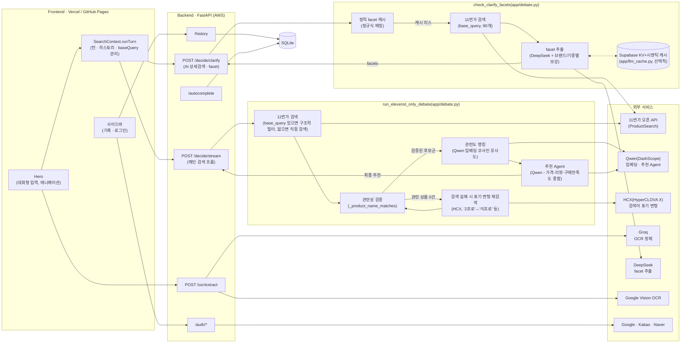
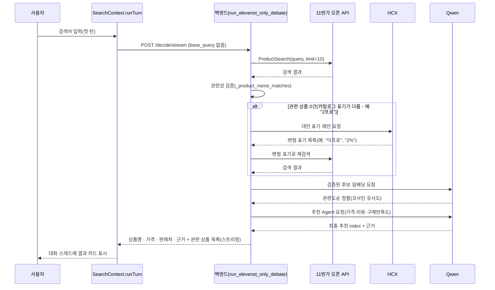

# αlpha Pick

alpha-pick-jet.vercel.app
---

## 1️⃣ 프로젝트 개요

### 프로젝트명 및 한 줄 소개

**αlpha Pick** — 검색어를 11번가 오픈 API의 실측 구조화 데이터로 검증하고, AI 추천 Agent가 가격·리뷰·구매만족도를 종합해 근거와 함께 하나의 답으로 압축해주는 쇼핑 가격비교 서비스.

### 프로젝트 개요도

> 2026-08-20 재설계 이후 구조. 다나와 스크래핑 + Tavily 검색 + Google ADK 멀티에이전트
> 디베이트(정제 → 검색 → 3모델 병렬 제안 → 교차검증 → 심사) 파이프라인 전체를 걷어내고,
> 11번가 오픈 API(ProductSearch, 1st-party 구조화 데이터) 하나로 통일했다. 검색 →
> 관련성 검증(`_product_name_matches`) → 검증된 후보군만 → 추천 Agent(Qwen 임베딩 관련도
> 랭킹 + LLM 최종 선택) → 최종 추천의 단순한 선형 파이프라인이다. Human-in-the-loop은
> 텍스트 재검색 대신 구조적 로컬 필터링으로 후보군을 좁혀나가고(카테고리 축은 11번가가
> 카테고리 필터 자체를 지원하지 않아 되묻지 않음), 검색어 표기가 카탈로그와 다를 때만
> (예: "2프로"↔"이프로") HCX가 대안 표기를 제안해 재검색한다. 자세한 배경은
> [주요 의사결정 사항](#주요-의사결정-사항) 참고.



### 적용 기술 스택

| 영역 | 스택 |
| --- | --- |
| Frontend | React 18, Vite 6, TypeScript, Tailwind CSS v4, Framer Motion(`motion`), React Router (HashRouter) |
| Backend | FastAPI, Python, httpx, PyJWT |
| 검색 | 11번가 오픈 API(ProductSearch) - 1st-party 구조화 데이터, 스크래핑 없음 |
| 관련성 검증 | rapidfuzz 토큰 유사도 + 모델/규격 토큰 충돌 가드 + 상호배타 토큰 가드(`_product_name_matches`) - 검색어와 실제로 일치하는 상품만 후보로 인정 |
| 추천 Agent | Qwen(DashScope) 임베딩(`text-embedding-v3`)으로 후보를 관련도순 정렬 → Qwen이 가격·리뷰·구매만족도를 종합해 최종 추천 선택(실패 시 최저가 규칙 기반 폴백) |
| 검색어 표기 변형 | HCX(HyperCLOVA X, HCX-DASH-002) - 1차 검색이 관련 상품을 못 찾으면 카탈로그 표기 차이(예: "2프로"↔"이프로"↔"2%")를 추론해 대안 표기로 재검색 |
| Human-in-the-loop | DeepSeek가 11번가 검색 상품명 목록에서 facet(라벨 자유, 상호 교차 필터링)을 추출. 카테고리 축은 되묻지 않고(11번가가 카테고리 필터 미지원), 드릴다운 후속 턴은 재검색 대신 순수 로컬 필터링으로 후보군을 좁힘 |
| LLM 응답 캐시 | Supabase(Postgres + pgvector) 기반 KV(완전 일치) + 시맨틱(임베딩 유사도) 2단 캐시 - 선택적, 미설정 시 안전하게 no-op |
| 이미지 인식 | Google Cloud Vision (텍스트 추출) → Groq (정제 · 검색어 추출) |
| 인증 | Google / Kakao / Naver OAuth2 + JWT 기반 세션 |
| 저장소 | SQLite (검색 기록 · 자동완성 인덱스), Supabase(LLM 캐시, 선택적) |
| 배포 | Docker, nginx, certbot, AWS GPU 인스턴스, nip.io(Backend) / GitHub Pages, Vercel(Frontend), GitHub Actions(main 푸시 시 GitHub Pages 자동 배포 - 테스트 게이팅은 없음, `pytest`/`npm run build`는 수동 실행) |

### 주제 선정 배경

쇼핑을 위해 여러 플랫폼 탭을 오가며 가격을 직접 비교해야 하는 번거로움에서 출발했다. 단순히 최저가를 나열하는 비교 서비스가 아니라, "왜 이 상품인지" 근거를 함께 제시하는 서비스를 목표로 했고, LLM이 상품 정보 자체를 지어낼 위험(환각)을 줄이기 위해 **실측 구조화 데이터로 검증된 후보만 LLM에게 보여주고 그중에서 고르게 하는 구조**를 채택했다(초기엔 3개 제안 모델 + 1개 심사 모델의 멀티에이전트 디베이트 구조였으나, 2026-08-20 재설계로 지금의 형태로 단순화됐다 - [주요 의사결정 사항](#주요-의사결정-사항) 참고).

### 목표 및 기대효과

- 여러 쇼핑몰을 직접 비교하는 시간을 줄이고, 근거가 붙은 단일 추천으로 의사결정을 단순화
- LLM이 상품 정보를 지어내지 않도록, 실측 구조화 데이터로 검증된 후보만 추천 대상으로 삼아 신뢰도를 높임
- 텍스트뿐 아니라 상품 사진(OCR)으로도 검색이 가능해 입력 장벽을 낮춤

### 팀원 구성 및 역할 분담

| 팀원 | 주요 역할 |
| --- | --- |
| parkminsung45 (박민성) | 백엔드 아키텍처·검색/추천 엔진 설계, 배포/인프라, 소셜 로그인, 저장소 거버넌스, 프론트엔드 UI/UX 전반 |
| tmdals3000 (이승민) | 검색 후보 매칭·비용 최적화, AI 상세검색(멀티턴 clarify), 대화형 채팅 UI |
| lou0-ux | OCR 파이프라인, 검색 품질 안정화 |
| Seojeong Woo (우서정) | 서버 인스턴스 관리, 데이터베이스 구축, 모델 설정 트러블슈팅 |

아래는 각 팀원의 주요 기여를 시간순이 아닌 영역별로 정리한 것이다(커밋 이력 기준 - 자세한 배경/트러블슈팅은 각각 아래 시간순 변경 이력·문제 해결 내역·성능 개선 기록 절 참고).

#### parkminsung45 (박민성) — 백엔드 아키텍처 · 인프라 · 풀스택

- 검색/추천 파이프라인을 프로젝트 전 기간에 걸쳐 세 차례 근본적으로 재설계: (1) Gemini/Claude 기반 멀티에이전트 토론 엔진 최초 구축, (2) 역할 분리형 Google ADK 파이프라인 + HITL(Human-in-the-loop) 되묻기 + 시맨틱 검색 캐시 도입, (3) 다나와 스크래핑 + Tavily 검색 + ADK 멀티에이전트 디베이트를 전량 제거하고 11번가 오픈 API(ProductSearch) 기반 단일 파이프라인으로 전면 재구축
- 추천 Agent(임베딩 코사인 유사도 관련도 랭킹 + LLM 최종 선택, 실패 시 최저가 규칙 폴백) 설계·구현
- HITL 되묻기 흐름을 "질의 재구성 후 재검색" 방식에서 "구조적 로컬 필터링" 방식으로 재설계해 중복 검색 비용 제거
- Google/Kakao/Naver 소셜 로그인(OAuth) 백엔드·프론트엔드 전체 구현
- AWS EC2 + Docker + nginx/TLS 백엔드 배포, GitHub Pages/Vercel 프론트엔드 배포 파이프라인 구축 및 CORS·도메인·인증서·IP 차단 우회 등 배포 인시던트 다수 트러블슈팅
- LLM 프로바이더 다중화 관리: OpenAI → Gemini/Claude → Groq → Qwen/DeepSeek/HCX로 이어지는 모델 슬롯 교체·비용/속도 튜닝(예: Qwen thinking mode 비활성화로 응답 지연 20~95초 → 2~5초 단축)
- GitHub 저장소 거버넌스 구성: 브랜치 보호 규칙(main 최소 1인 승인 필수) 및 Repository Ruleset 설계·트러블슈팅
- 대규모 죽은 코드 정리를 여러 차례 주도(사용되지 않는 브랜드 단축검색/대량구매 생성 경로, 고정 축 clarify UI 등을 코드 추적을 통해 직접 발굴 후 제거) 및 README 아키텍처 문서 지속 갱신

#### tmdals3000 (이승민) — 검색 정확도 · 비용 최적화 · 대화형 UX

- 검색어 자동완성(cold-start) 기능 구현
- 다나와 어댑터(판매자별 가격표 파싱, 아웃링크 해석) 설계, 다나와 후보를 1급 심사 후보로 승격시키는 로직 구현 - 이후 다나와 폐기·11번가 전환 작업에도 참여
- 후보 매칭 정확도 개선: 사양 표기 차이로 인한 오매칭을 막는 계열(family) 기반 가드 설계, 부당하게 배제되던 G마켓/옥션 판매처 포함, exclusive-token 가드로 동일 단어·다른 상품 오매칭 방지
- LLM 비용/응답속도 최적화 주도: propose 단계 LLM 호출을 3개에서 조건부 1개로 축소, 그라운딩을 순차 게이트 구조로 재구성, 비상품 잡담·짧은 검색어를 LLM 호출 전에 걸러내는 fast-fail 로직 추가
- AI 상세검색(멀티턴 facet 되묻기) 기능을 설계하고 11번가 전환 이후에도 지속 개선(facet 자동 제출, 대화체 질의 정제, 드릴다운 검색어 정리)
- 채팅형 UI(메시지 타임스탬프, 재시도, 수정 기능) 구현
- 오프라인 100개 질의 셋 기반 회귀/커버리지 측정 하네스 구축 및 그라운딩 채점 로직 분리(다나와/ADK 시절 전용이라 2026-08-26에 하네스 자체는 제거됨)

#### lou0-ux — OCR 파이프라인 · 검색 품질 안정화

- Google Cloud Vision 기반 OCR 텍스트 추출 파이프라인 최초 구현(이후 정제 모델이 Gemini → Groq로 교체되는 과정에서도 파이프라인 유지보수)
- OCR 정제 실패 시 규칙 기반 폴백 체인 설계, 파이프라인 에러 처리 안정성 개선
- 핸드폰 케이스 등 액세서리 카테고리에서 무관한 상품이 섞이는 검색 품질 문제 수정
- AI 상세검색이 이미 질의에 포함된 값을 다시 facet으로 되묻는 중복 질문 버그 수정
- 대량구매 검색 경로 안정성 개선
- 최종 결과 카드 UX 실험("다른 관점에서 보기" 칩) 및 11번가 오픈 API 스모크 테스트 스크립트 작성

#### Seojeong Woo (우서정) — 인프라 · 모델 설정 관리

- 서버 인스턴스 관리, 데이터베이스 구축 및 기술 리서치
- Groq 모델 기본값 설정 오류 수정, 불필요한 LLM 재시도 로직 제거로 응답 지연시간 단축

### 시간순 변경 이력

날짜는 실제 커밋 기준(`git log`). 아래는 그날의 핵심만 압축한 타임라인이고,
"왜 그렇게 했는지"의 근거는 바로 아래 [주요 의사결정 사항](#주요-의사결정-사항)과
[문제 해결 내역](#문제-해결-내역-troubleshooting)에 항목별로 자세히 남아있다.

| 날짜 | 도입 / 변경 / 개선 |
| --- | --- |
| 2026-08-04 ~ 06 | Figma Make로 뽑은 포트폴리오 템플릿(Cherry-Pick)을 실 프로젝트 구조로 전환(→ Étiquette 리브랜드). FastAPI 백엔드 스캐폴딩 + GPT·Gemini·DeepSeek 멀티에이전트 구매 의사결정 엔진 최초 구현 |
| 2026-08-07 | Google·Kakao·Naver 소셜 로그인, 계정별 검색 기록 사이드바, OCR(Google Vision + Gemini 정제) 이미지 검색 파이프라인 추가. 검색 소스를 네이버쇼핑 → Google Merchant Center로 교체. AWS GPU 인스턴스 + nip.io 기반 배포 최초 구축 |
| 2026-08-08 ~ 09 | "How We Curate"(멀티에이전트 토론 흐름 설명) 섹션, README 프로젝트 리포트 섹션 신설 |
| 2026-08-10 | 다나와 실측 가격 어댑터 최초 구현(판매처별 가격표 파싱, STEP 1~5 라이브 검증) · 쿼리 정규화 검색 캐시 도입 · `fusion.dedup` 후보 병합 가드(가격 호환성 + 이름 유사도) 추가 · Étiquette → αlpha Pick 리브랜드 |
| 2026-08-11 | 다나와 A등급(구매 링크 생성 가능) 후보를 judge 풀에 직접 승격(PART 4-2) · 동일 상품 판정 기준을 판매처+가격 → 상품명으로 전환(STEP 6) · **Google ADK 기반 역할 분리 멀티에이전트 파이프라인 + 의미 기반 검색 캐시 도입(현재 아키텍처의 골격)** · Human-in-the-loop 최초 도입 |
| 2026-08-12 | 카테고리 기반 HITL 축 최적화(Gemini 16종 분류로 용량/개수 관련성 판정) · 다나와 최저가 URL 해석(브릿지 엔드포인트) + 대화형 HITL(LLM이 되묻는 문장 생성) 추가 |
| 2026-08-13 | "gpt" 에이전트 슬롯을 OpenAI → Qwen(DashScope)으로 전환 · 완전 무관 후보뿐일 때의 relaxed fallback 최초 추가 · ChatGPT식 멀티턴 대화 스레드(`ChatTurn`)로 프론트 전환 · `skip_clarify`로 재질문 반복 버그 수정 · 죽은 코드/미사용 npm 의존성 1차 정리 |
| 2026-08-14 | Gemini·Claude → Groq 무료 API 전면 전환 · `/decide/clarify`와 ADK 내부 안전망의 facet 추출 로직 통합 · "용기형태" facet 구매유형 오분류 수정 · 쿠팡 교차 확인(challenge 3번째 그라운딩 신호) 추가 · 깨진 쿠팡 구매링크 노출 버그 3건(연쇄 원인) 수정 · 액세서리(핸드폰 케이스 등) 검색 품질 개선 · 대규모 죽은 코드 정리 · README 대폭 갱신 |
| 2026-08-16 | relaxed fallback을 challenge 재검증으로 게이팅해 하드닝(그라운딩 우회 경로 차단) · `Decision.verified` 필드 추가로 최종 응답의 그라운딩 검증 여부를 API 전체에 노출 · 네이버쇼핑을 쿠팡과 동일 패턴의 2번째 소프트 교차 확인 소스로 추가 · 알려진 상품 세트 기반 그라운딩 정확도 회귀 스크립트(`scripts/grounding_regression.py`) 추가 · 다나와 실측가 후보에 검색어 관련성 가드 추가(아이폰→아이패드 오추천 버그 수정) · facet crossfilter로 이미 좁혀진 축은 되묻지 않도록 수정(불필요한 clarify 다발 버그) · 다나와 가격비교 페이지 자체를 최종 후보로 받아들이던 버그 수정 |
| 2026-08-17 | 다나와 가격비교 페이지 필터를 도메인 기반으로 일반화(모바일 URL 변형 누락 대응) · 그라운딩 회귀 스크립트에 실행 전 제공자 헬스체크 + 도중 연속 실패 시 즉시 중단 안전장치 추가 · README에 그라운딩 회귀 실험 이력을 표+그래프로 자동 갱신하는 기능 추가 · 배포 저장소를 Prototype-1- 하나로 일원화(구 Alpha-pick00.github.io가 비공개/개명되며 배포 대상에서 제외, Pages 활성화 + 누락 환경변수 설정 + 죽은 배포 터널 재기동) · 안전장치의 쿼터 소진 감지가 파이프라인 내부 예외 삼킴에 뚫리는 문제 발견 후 문자열 매칭 → 연속 실패 기반 헬스체크 재확인 방식으로 재설계 |
| 2026-08-18 | 배포 터널 재소진 + 구 GitHub Pages URL 404 확인 후 터널 재기동·`VITE_API_URL` 갱신·재배포로 복구 · "gemini" 슬롯 기본 Groq 모델을 llama-3.3-70b-versatile → gpt-oss-20b로 교체 · 프론트엔드를 Vercel에도 배포하고 백엔드를 기존 AWS 인스턴스에 최신 코드로 재배포(저장소 재동기화, nginx+TLS를 새 인스턴스 IP로 재발급), CORS에 Vercel 도메인 추가 |
| 2026-08-19 | 취향 주도 카테고리(패션의류/잡화 등)에 스타일 가이드 응답 모드 추가(검증된 후보를 스타일별로 그룹핑) · 토큰 사용량 최적화(clarify facet 추출 가드, classify_category 모델 재배정) · 저장소 전반 죽은 코드/미사용 설정·의존성 정리(백엔드·프론트엔드) · README 정리 |
| 2026-08-20 | **다나와 스크래핑 + Tavily 검색 + Google ADK 멀티에이전트 디베이트 파이프라인 전체 제거, 11번가 오픈 API(ProductSearch) 하나로 통일**(현재 아키텍처의 골격) · 추천 Agent 추가(Qwen 임베딩 관련도 랭킹 + LLM 최종 선택, 실패 시 최저가 폴백) · HITL을 쿼리 재구성 재검색 방식에서 구조적 로컬 필터링으로 재설계(카테고리 축은 11번가가 필터 미지원이라 되묻지 않음) · Supabase 기반 LLM 응답 캐시(KV+시맨틱) 스캐폴딩 · Qwen "thinking mode" 비활성화로 응답 지연 20~95초 → 2~5초 단축 · Groq 기반 검색어 표기 변형 폴백 추가("2프로"/"이프로"/"2%" 매핑) · GitHub 브랜치 보호 규칙 추가(main은 최소 1인 승인 필수) |
| 2026-08-21 | 브랜드 단축검색/대량구매 생성 경로 + 고정 4축 clarify UI(`FixedAxisClarifyCard`) + 미사용 `skip_intent_check` 요청 필드 제거 · README 팀원 구성 절을 커밋 이력 기반 상세 기여 목록으로 확장(개인 포트폴리오용) · 검색어 표기 변형 폴백을 Groq에서 HCX(HyperCLOVA X, `HCX-DASH-002`)로 교체 |
| 2026-08-24 | README 전면 재검증 - 코드와 실제로 다른 서술 발견해 정정: 프론트 `GradientChatInput`(실제로는 `Hero`) · 존재하지 않는 "사운드" 기능 서술 · 어디서도 호출 안 되는 죽은 `search_categories`/Categories API를 현재 데이터 소스처럼 서술하던 부분 · `scripts/grounding_regression.py`가 제거된 `debate.run_single_debate`를 호출해 실행하면 깨지는 상태(2026-08-20부터)라는 사실 미기재 · "GitHub Actions(CI)" 표기가 실제로는 테스트 게이팅 없는 배포 전용 워크플로였던 것 |

### 주요 의사결정 사항

- **검색 데이터 소스**: Google Merchant API → Tavily 검색 API + 국내 리테일러 15곳 도메인 한정
- **판단 구조**: 단일 모델 호출 → ChatGPT · Gemini · DeepSeek 3개 병렬 제안 + Claude 심사의 4단계 구조
- **Google 로그인 방식**: 공식 iframe 버튼 → `google.accounts.oauth2` 팝업 + 커스텀 버튼
- **CORS 정책**: origin을 알려진 도메인으로만 제한(와일드카드 금지)
- **검색 기록 저장**: 로그인 시 서버(SQLite), 비로그인 시 로컬(localStorage)로 분기
- **판단 구조 재설계**: 단일 호출 구조를 Google ADK 기반 정제 → 검색 → 제안(3모델 병렬) → 병합 → 교차 검증 → 심사 파이프라인으로 분리
- **후보 병합 기준**: 필드별(가격 · 판매처 · URL) 독립 다수결 → 최저가 매물 하나에서 세 필드를 함께 채택
- **Human-in-the-loop 도입 방식**: ADK 내부 pause/resume 대신 앱 레벨 무상태 재실행 채택 — 브랜드 · 제품 · 용량 · 개수가 모호하면 파이프라인을 멈추고 한 축씩 되묻는다
- **카테고리 기반 HITL 축 최적화**: 검색어를 16개 대분류로 분류해, 카테고리별로 용량 · 개수 축의 관련성을 다르게 판정(예: 식품 중 음료만 용량 유효)
- **다나와 실측 가격 직접 연동**: 다나와 검색결과/상세페이지를 직접 페치해 A등급 판매처 실측가 확보, 대조 가능하면 `price_source`를 `danawa_offer`로 표시
- **다나와 가격비교 페이지 → 구매 URL 변환**: 최종 URL이 다나와 페이지면 내부 AJAX 엔드포인트로 최저가 브릿지 URL을 조회해 치환
- **검색 도메인 15곳 → 다나와로 축소**: 리테일러마다 페이지 구조가 달라 스니펫 파싱 시 오매칭이 있어, 가격비교 사이트 하나로 좁힘(에누리는 어댑터 없이 노출만 되던 상태라 함께 제외)
- **Human-in-the-loop 이원화**: 고정 4축(GPT, Tavily 결과 기반) + AI 상세검색 facet(DeepSeek, 다나와 결과 기반) 병행 — 짧은 질의는 facet을 먼저 시도하고 못 찾으면 고정 축으로 폴백
- **대화형 UI로 통합**: 프론트를 `ChatTurn` 배열 기반 멀티턴 스레드로 재구성, 브랜드/facet/축 선택을 전부 새 턴으로 통일
- **AI 오케스트레이션과 다나와 통합 병합**: 두 갈래로 개발되던 기능을 ADK 파이프라인 하나로 병합, `skip_clarify` 플래그로 재질문 회귀 수정
- **"gpt" 슬롯을 GPT → Qwen으로 교체**: 내부 식별자(`agent="gpt"`, 파일/함수명)는 유지, 호출 모델만 DashScope Qwen으로 교체. 프론트 표시 이름만 "Qwen"으로 변경
- **Gemini · Claude → Groq로 교체**: `agent="gemini"` 식별자는 유지, 호출 모델만 교체. refine은 `gpt-oss-20b`, judge는 `gpt-oss-120b`, categorize/OCR정제/propose "gemini" 슬롯은 `llama-3.3-70b-versatile`. 검색 결과 스니펫을 500자로 잘라 담도록 `format_results_block` 조정
- **다나와 A등급 실측가 주입을 ADK 파이프라인으로 포팅**: `_DanawaFetchNode`를 propose의 `ParallelAgent` 소속으로 추가, 기존 병합/그라운딩 로직에 그대로 태움. 이전엔 `DecideResponse.price_table`이 라이브 경로에서 항상 null이었음
- **clarify 백엔드 추출 로직을 facet 하나로 통합**: `/decide/clarify`와 ADK 내부 안전망이 같은 facet 추출 파이프라인(`_extract_facets`)을 공유하도록 통합, 입력 소스만 다르게 유지. 고정 4축 전용 헬퍼는 facet 버전으로 교체하고 원본 삭제
- **facet 크로스필터를 하이퍼그래프 incidence 구조로 재구성**: 브루트포스 재스캔 방식을 `_build_facet_value_incidence`(값 → 상품 인덱스 집합) 기반 집합 연산으로 교체, 결과는 기존과 동치(테스트로 검증)
- **사용하지 않는 코드 일괄 정리**: 레거시 직접-구현 경로(`run_single_debate_price_table_variant`와 그 전용 헬퍼), 고정 4축 전용 필터 함수, 미사용 정규식 헬퍼, 미사용 병합 함수, 도달 불가능한 중복 코드, 미사용 프론트 데모 라우트/scaffold, 미사용 SSE 클라이언트/clarify-match 엔드포인트, 미사용 prop/훅을 전수 조사 후 제거
- **쿠팡 검색을 challenge 단계의 3번째 그라운딩 소스로 추가**: `search.search_coupang()`으로 독립된 쇼핑몰 신호를 얹어 `_CoupangCheckNode`가 propose와 동시 실행(지연시간 추가 없음). 페이지를 직접 파싱하지 않고 Tavily 스니펫만 challenge 참고 자료로 전달, 소프트 신호로만 사용
- **그라운딩 3종 강화**: (1) relaxed fallback도 정상 경로와 동일한 challenge 검증을 거치도록 하드닝, `Decision.verified` 필드로 검증 여부를 API 전체에 노출 (2) 네이버쇼핑을 쿠팡과 동일한 패턴의 2번째 소프트 교차 확인 소스로 추가 (3) `scripts/grounding_regression.py` 그라운딩 정확도 회귀 스크립트 추가
- **실험 안전장치 도입 및 재설계**: 제공자 쿼터 소진 감지를 "실패 텍스트의 소진 신호 문자열 매칭" 방식에서 "사유 불문 연속 2건 실패 시 헬스체크로 직접 재확인" 방식으로 재설계(파이프라인이 예외를 어떻게 감싸든 영향받지 않음). 오염된 실행 결과는 히스토리에서 되돌림
- **README 그라운딩 실험 이력 자동 갱신**: `scripts/grounding_regression_history.json`에 완주한 실행마다 결과를 append하고, README의 `GROUNDING_HISTORY_START/_END` 구간을 표 + Mermaid 그래프로 자동 재생성
- **배포 저장소를 Prototype-1- 하나로 일원화**: GitHub Pages 활성화, 배포 환경변수 설정, Cloudflare 터널 재기동
- **gemini 슬롯 기본 Groq 모델을 gpt-oss-20b로 교체**: 이후 그라운딩 파일럿에서 20b가 refine과 예산을 나눠 쓰며 더 빨리 고갈되는 게 확인돼, judge와 공유하는 `gpt-oss-120b`로 재조정
- **프론트엔드를 Vercel에도 배포하고 백엔드를 AWS 인스턴스로 이전**: 기존 Cloudflare Quick Tunnel을 벗어나 AWS EC2 인스턴스로 백엔드 이전(`backend/deploy/DEPLOY.md` 참고), nginx/TLS를 새 IP로 재발급. 프론트는 GitHub Pages를 유지한 채 Vercel에 추가 배포, CORS에 Vercel 도메인 추가
- **토큰 사용량 최적화**: `_extract_clarify_options`가 후속 질의 라운드에도 무거운 facet 추출(브랜드별 최대 15개 병렬 DeepSeek 호출)을 무조건 실행하던 것을 가드 처리, 브랜드별 팬아웃도 6개로 제한. `classify_category`를 부하가 몰린 `gpt-oss-120b`에서 여유 있는 `gpt-oss-20b`로 재배정
- **저장소 정리**: 호출부가 없는 함수/클래스, 옛 프로토타입 디렉터리, 대체된 Google Merchant/임베딩 기반 검색 캐시 모듈과 그 설정·의존성을 제거. 프론트의 미사용 멀티 대화 전환 상태, 중복 CSS 파일, 빈 PostCSS 설정 제거
- **다나와/Tavily/ADK 멀티에이전트 파이프라인 전체 제거, 11번가 오픈 API로 통일**: 다나와는 스크래핑(HTML 파싱, IP 차단 위험)이었지만 11번가 오픈 API는 1st-party 구조화 데이터(XML)라 그 위험 자체가 없음. 관련성은 `_product_name_matches`(토큰 유사도 + 모델/규격 충돌 가드 + 상호배타 토큰 가드)로 규칙 기반 검증. 부수적으로 그 파이프라인에만 쓰이던 Tavily 검색 계층과 Google ADK(`SequentialAgent`/`ParallelAgent`, 이미 deprecated 표시였음)까지 함께 제거돼 의존성이 크게 줄었다(`google-adk`, `litellm`, `google-genai`, `beautifulsoup4`, `lxml`, `apscheduler`)
- **추천 Agent 도입**: 규칙 기반 최저가 선택 대신, 검증된 후보를 Qwen 임베딩(`text-embedding-v3`) 코사인 유사도로 관련도순 정렬해 "관련 상품" 목록으로 노출하고, LLM(Qwen)이 가격뿐 아니라 리뷰 수·구매만족도까지 보고 최종 추천을 고름 - 실패하면 최저가 규칙 기반으로 폴백(그라운딩은 그대로 유지)
- **HITL을 쿼리 재구성 재검색에서 구조적 필터로 재설계**: 드릴다운 후속 턴이 매번 재구성된 전체 문자열로 새로 검색하던 것을, 안정적인 `base_query`로 한 번만 검색한 뒤 사용자가 덧붙인 답을 순수 로컬 필터링(`_filter_items_by_extra_terms`)으로 좁히도록 변경 - 카테고리 축은 11번가가 카테고리 코드 필터를 지원하지 않고(실측 확인) 카테고리 이름이 상품명 텍스트에도 거의 안 나와 구조적 필터가 안 통하므로, 애초에 사용자에게 되묻지 않음(DeepSeek이 자체적으로 뽑아온 "카테고리" facet도 걸러냄)
- **Qwen "thinking mode" 비활성화**: `qwen3.7-plus`가 DashScope 기본값으로 내부 추론 과정을 다 생성한 뒤 응답하는 모드였음이 드러남(짧은 질문에도 20~95초) - `extra_body={"enable_thinking": false}`로 2~5초까지 단축, 별도 모델 교체 없이 해결
- **Groq 기반 검색어 표기 변형 폴백**: 11번가 검색 엔진이 사용자 표기("2프로")와 카탈로그 표기("이프로"/"2%")가 달라 관련 상품을 하나도 못 찾는 경우가 있음을 실측 확인 - 1차 검색 실패 시에만 Groq이 대안 표기를 제안해 재검색(관련성 판정도 원래 질의가 아니라 변형 표기 기준)
- **Supabase 기반 LLM 응답 캐시 스캐폴딩**: KV(완전 일치)+시맨틱(임베딩 유사도) 2단 캐시를 facet 추출(호출당 최대 8회 LLM 호출 가능)에 배선 - `SUPABASE_URL`/`SUPABASE_KEY` 미설정 시 안전하게 no-op
- **GitHub 브랜치 보호 규칙 추가**: `main`에 최소 1인 승인 필수 + 승인 후 새 커밋 시 재승인 필요(dismiss stale reviews) + 직접 push/force-push/삭제 차단 - 이후 작업은 브랜치 생성 → PR → 리뷰 승인 → 머지 순서로 진행
- **브랜드 단축검색/대량구매 생성 경로 및 고정 4축 clarify UI 제거**: `check_clarify_facets`(facet 추출)가 `brands`/`products`/`volumes`/`quantities`를 채우지 않게 되며 두 기능(브랜드로 바로 검색하는 단축 경로, 고정 4축 UI `FixedAxisClarifyCard`)이 조용히 죽은 코드가 돼있던 것을 발견 - 새로 생성하는 경로만 프론트/백엔드 양쪽에서 제거하고, 과거 저장된 히스토리에 남아있을 수 있는 표시 경로·타입은 하위호환을 위해 유지. 같은 조사 과정에서 백엔드가 더 이상 읽지 않던 `skip_intent_check` 요청 필드도 함께 제거(프론트의 로컬 되묻기 게이팅 용도는 유지)
- **검색어 표기 변형 폴백을 Groq에서 HCX(HyperCLOVA X)로 교체**: 한국어 표기 변형 추론(예: "2프로"↔"이프로"↔"2%")은 한국어 특화 모델이 유리하다고 판단해 교체. CLOVA Studio의 OpenAI 호환 엔드포인트(`HCX-DASH-002`)를 그대로 사용하되, `response_format`의 `json_object` 모드를 지원하지 않아 프롬프트 지시 + 정규식 파싱으로 대체. OCR 정제(`app/ocr/cleanup.py`)는 별개 기능이라 Groq를 그대로 유지

### 문제 해결 내역 (Troubleshooting)

- **검색 품질 저하**: 목록/콘텐츠 페이지가 검색 결과에 섞이는 문제 → 도메인 화이트리스트 + 제네릭 목록 URL 정규식 필터링 + 브랜드-URL 일치 검증으로 수정
- **정규식 오탐**: `search.shopping.naver.com`이 제네릭 목록 URL로 오분류 → 부정 후방탐색(negative lookbehind)으로 수정
- **동일 상품 병합 시 필드 불일치**: 가격 · URL · 판매처를 필드별로 독립 다수결 처리해 서로 다른 상품의 필드가 섞임 → 최저가 매물 하나에서 세 필드를 함께 채택하도록 수정
- **Human-in-the-loop 선택이 수렴하지 않음**: 이미 답한 조건을 매 검색마다 재추출해 같은 질문을 반복 → 질의 텍스트에 이미 반영된 조건은 재추출 결과와 무관하게 확정 처리
- **자동완성 추천창이 결과 화면 뒤에 남음**: 검색 상태와 무관하게 질의 변경마다 자동완성이 재오픈 → idle 상태일 때만 노출되도록 수정
- **멀티턴 드릴다운이 수렴하지 않음**: 내부 애매함 판정이 `skip_intent_check` 플래그와 무관하게 매번 재동작해 같은 질문이 반복 → `skip_clarify` 플래그를 파이프라인 끝까지 관통시켜 후속 턴에서 조기 종료를 건너뛰도록 수정
- **"용기형태" facet에 구매유형 값이 섞임**: facet 추출 프롬프트가 "용기형태"의 의미를 정의하지 않아 구매유형 수식어를 물리적 용기 형태로 오분류 → 프롬프트에 두 라벨을 명시하고, 코드 레벨 블랙리스트 필터 추가
- **"핸드폰 케이스" 검색 품질 저하 3종**: (1)(2) 구매유형/특징 facet에 근거 없는 값이 뜸 → 라벨 정의를 프롬프트에 명시 + 화이트리스트 필터 추가 (3) 옛 모델이 검색 결과에 섞임(상품명 유사도만으로 동일 상품 판정해 다른 모델이 병합됨) → 모델/규격 토큰 충돌 가드를 `app.spec_match`로 공용화해 병합 단계에도 적용
- **깨진 쿠팡 구매링크가 최종 추천으로 노출됨**: 다나와의 쿠팡 제휴 코드(`TP40F`) 자체가 접근 제한됨 → `danawa_mall_map.py`에서 A등급 판정 제외. 연쇄로 발견된 관련 버그 2건도 함께 수정(bridge_passthrough 재확인 강화, `/bridge/` 경로를 재해석 대상에서 제외)
- **다나와 실측가 후보가 검색어와 무관한 상품을 추천함**: `pick_primary()`가 판매처 개수만으로 대표 페이지를 골라 관련성을 확인하지 않음 → 후보 생성 전에 검색어와의 이름 매칭 가드 추가
- **구체적인 검색어인데도 불필요하게 되묻기가 뜸**: `_facet_resolved`가 문자열 완전 일치만 확인해 브랜드명과 제조사명이 다르면 매칭 실패 → crossfilter 기반 판정(`_facet_options_for_query`) 추가
- **최종 추천의 판매처가 "다나와" 자신, 가격은 빈 문자열로 노출됨**: 다나와 가격비교 페이지 자체가 challenge를 통과함 → `is_danawa_comparison_page()`를 후보 필터와 relaxed fallback에 연결해 입구에서 차단
- **다나와 가격비교 페이지 필터가 모바일 URL 변형을 놓침**: 정규식이 PC 경로만 걸렀음 → 도메인 + 경로 기반 일반 판정 방식으로 교체
- **쿼터 소진 안전장치가 파이프라인의 내부 예외 삼킴에 뚫림**: 원본 429 예외가 내부에서 일반 예외로 감싸져 문자열 매칭이 무력화됨 → "사유 불문 연속 2건 실패" 트리거 + 헬스체크 재확인 방식으로 재설계, 오염된 결과는 되돌림
- **구 GitHub Pages URL이 404, 배포 API 터널이 재차 다운**: 저장소명 변경으로 Pages URL 규칙이 깨지고, 동시에 Cloudflare Quick Tunnel이 재연결 루프에 빠짐 → 새 터널 기동 + `VITE_API_URL` 갱신 + 재배포로 복구
- **새로 발급받은 Qwen 키가 기존 워크스페이스 엔드포인트에서 거부됨**: 새 키가 다른 워크스페이스 소속으로 확인 → 직전까지 정상 동작하던 키로 롤백
- **OCR 정제/카테고리분류/propose "gemini" 슬롯이 전부 404로 실패**: Groq가 `llama-3.3-70b-versatile`을 무료 티어에서 서비스 종료 → `gpt-oss-20b`로 교체. 이후 refine과 예산을 나눠 쓰며 더 빨리 소진되는 게 확인돼 `gpt-oss-120b`로 재조정
- **AWS 재배포 직후 실제 검색이 전부 실패**: Tavily가 플랜 한도 초과(432) 반환 → 새 키로 교체, 로컬/AWS 양쪽 `.env` 갱신
- **Vercel GitHub 연동 프리뷰 빌드가 매번 실패**: Root Directory 설정이 비어 있어 리포 루트에서 빌드 시도 → Vercel API로 `rootDirectory: "frontend"` 설정
- **HCX API 키가 401로 거부됨**: CLOVA Studio 콘솔에서 발급받은 키가 구버전(테스트/서비스 앱) 형식이었음 - OpenAI 호환 엔드포인트(`/v1/openai`)는 `nv-`로 시작하는 신버전 키만 받는다("Invalid Key - Please use new API Key that starts with 'nv-*'") → `nv-`로 시작하는 키로 재발급받아 해결. 두 발급 체계가 다르다는 점이 문서에 명시돼 있지 않아 처음엔 원인 파악에 혼선

---

## 2️⃣ Project 과정 기록

### 데이터 소스 및 탐색

- **검색 데이터**: 11번가 오픈 API(ProductSearch)로 실시간 조회 - 1st-party 구조화 XML 응답(상품명 · 가격 · 판매자 · 리뷰 수 · 구매만족도 · 상세 URL이 필드로 분리돼 있어, 스크래핑처럼 스니펫에서 오파싱할 위험이 없음)
- **카테고리 데이터**: `fetchers/elevenst.py`에 `option=Categories` 실측 카테고리 집계 조회 함수(`search_categories`)가 있지만, 2026-08-20 "카테고리 축은 아예 다루지 않는다" 결정 이후 실제로는 어디서도 호출되지 않는 죽은 코드다(`app/price_table.py::_search_elevenst_categories`도 정의만 있고 호출부가 없음 - `tests/test_clarify_facets.py`에 오히려 "호출되면 안 된다"는 회귀 테스트가 있음). AI 상세검색의 "카테고리" facet은 대신 DeepSeek이 상품명에서 자체적으로 뽑아온 걸 의도적으로 걸러낸다(`app.debate.check_clarify_facets`)
- **이미지 데이터**: 사용자가 업로드한 상품 사진 → Google Cloud Vision으로 텍스트 추출

### 전처리(검색 결과 정제) 방법

- 관련성 검증(`_product_name_matches`): 토큰 유사도(rapidfuzz) + 모델/규격 토큰 충돌 가드 + 상호배타 토큰 가드 3단 - 검색어와 실제로 같은 상품인지 확인된 후보만 남김
- 검색어 표기가 카탈로그와 달라(예: "2프로") 1차 검색이 관련 상품을 하나도 못 찾으면, HCX가 대안 표기를 제안해 재검색
- OCR 원문에서 가격/바코드/프로모션 문구를 제거하고 상품명·용량 등 핵심 메타데이터만 남기는 Groq 정제 단계(`search_query` 추출)

### 평가 기준 (무엇으로 "좋은 답"을 판단할지)

- 실제 판매 중인 상품 페이지 URL인지 (목록/콘텐츠 페이지 배제)
- 검색어의 브랜드·상품과 실제 반환된 상품이 일치하는지
- 최종 추천에 가격·판매처·선정 근거가 모두 포함되는지

### 베이스라인 대비 개선

LLM에게 상품 정보를 통째로 맡기는 방식(베이스라인, 존재하지 않는 상품·가격을 지어낼 위험이 있음) 대비, 후보 자체를 11번가 오픈 API의 실측 구조화 데이터로만 구성하고 규칙 기반 관련성 검증을 먼저 거치도록 설계했다. LLM(추천 Agent)은 이미 검증된 후보 중에서 고르기만 해 그라운딩이 안 된 답을 낼 수가 없고, 실패해도 최저가 규칙 기반으로 안전하게 폴백한다.

### 아키텍처 (11번가 오픈 API 기반 선형 파이프라인)



짧고 애매한 검색어(예: "핸드폰")는 위 흐름 전에 `POST /decide/clarify`(11번가 검색 결과
기반 동적 facet, DeepSeek)를 먼저 시도한다 - 카테고리 축은 되묻지 않고, 드릴다운
후속 턴(`base_query`가 있는 턴)은 매번 재검색하는 대신 `base_query`로 한 번만 검색한
결과를 로컬 필터링(`_filter_items_by_extra_terms`)으로 좁혀나간다. facet을 못 찾으면
그대로 `/decide/stream` 경로로 넘어간다.

### API 상세 명세 (요청 → 내부 플로우 → 응답 값)

`backend/app/schemas.py`(Pydantic 모델) 기준 실제 필드. 코드가 바뀌면 이 절도 같이
갱신해야 한다 - 아래는 2026-08-21 기준.

#### `POST /decide/stream` — 메인 검색(NDJSON 스트리밍, 프론트가 실제로 쓰는 경로)

**요청** (`DecideRequest`, 이 엔드포인트가 쓰는 필드만)

| 필드 | 타입 | 의미 |
| --- | --- | --- |
| `query` | `str` | 검색어(필수) |
| `base_query` | `str \| null` | 드릴다운 후속 턴이면 그 체인의 첫 검색어(구조적 로컬 필터링용, 없으면 매번 새로 검색) |

**내부 플로우** (`app.debate.run_elevenst_only_debate_stream` → `run_elevenst_only_debate`)

1. `status` 이벤트 즉시 전송 → 프론트가 "11번가에서 검색하고 있습니다" 표시
2. `_search_candidates`: `base_query`가 있으면 그걸로 90개 검색 후 로컬 필터링, 없으면 `query`로 10개 직접 검색(11번가 `ProductSearch`)
3. `_product_name_matches`(rapidfuzz 토큰 유사도 + 모델/규격 충돌 가드 + 상호배타 토큰 가드)로 관련 없는 결과 제거 - 0건이면 `_search_with_query_variants`가 HCX에게 대안 표기를 물어 재검색
4. 그래도 0건이면 `RuntimeError` → `error` 이벤트로 스트리밍되고 흐름 종료
5. 검증된 후보를 Qwen 임베딩(`text-embedding-v3`) 코사인 유사도로 관련도순 정렬(`_rank_by_relevance`) → 이 순서 그대로가 응답의 `proposals`
6. `gpt.recommend_best`(실제 호출 모델은 Qwen)가 가격·리뷰 수·구매만족도를 보고 최종 index 선택 → 실패(키 없음/API 오류/응답 파싱 실패)하면 최저가 규칙 기반으로 폴백
7. `final` 이벤트로 완성된 `DecideResponse` 전체를 한 번에 전송

**스트리밍 이벤트** (한 줄에 JSON 객체 하나, `\n`으로 구분 - `application/x-ndjson`)

| `type` | 페이로드 | 시점 |
| --- | --- | --- |
| `status` | `{"stage": "searching"}` | 흐름 시작 직후 1회 |
| `final` | `{"result": DecideResponse}` | 성공 종료 시 1회(아래 응답 값 참고) |
| `error` | `{"message": str}` | 검증된 후보를 끝내 못 찾거나 예외 발생 시 |

**응답 값 — `DecideResponse`** (`final` 이벤트의 `result`, `/decide`의 응답 본문과 동일)

```json
{
  "mode": "single",
  "query": "나이키 에어포스1",
  "proposals": [
    {
      "agent": "elevenst",
      "product_name": "나이키 에어포스 1 07 화이트",
      "price": "129,000원",
      "retailer": "나이키공식스토어",
      "url": "https://www.11st.co.kr/products/1234567",
      "reasoning": "11번가 오픈 API 검증 결과 (관련도순 - 함께 볼만한 상품)",
      "error": null,
      "verified": true,
      "challenge_note": null,
      "proposed_by": null
    }
  ],
  "decision": {
    "product_name": "나이키 에어포스 1 07 화이트",
    "price": "129,000원",
    "retailer": "나이키공식스토어",
    "url": "https://www.11st.co.kr/products/1234567",
    "reasoning": "11번가 실측 검증 후보 중 추천 Agent(Qwen)가 선택 - 가격과 리뷰 수 모두 우수합니다",
    "chosen_agent": "elevenst",
    "price_source": "elevenst_offer",
    "verified": null
  },
  "price_table": null,
  "style_guide": null
}
```

- `proposals[]`: 검증 통과한 후보 전부, 관련도순 - "함께 볼만한 상품" 목록으로 그대로 노출됨. 이 경로에서는 `agent`가 항상 `"elevenst"`, `verified`가 항상 `true`(1st-party 구조화 데이터라 조회된 것 자체가 검증). `error` · `challenge_note` · `proposed_by`는 옛 다나와/ADK 멀티에이전트 시절 필드라 이 경로에서는 항상 `null`(스키마 하위 호환용으로 유지 - `HistoryEntry`에 저장된 과거 기록이 이 필드들을 쓸 수 있어서 타입만 남겨둠)
- `decision`: 최종 추천 1건. `price_source`는 항상 `"elevenst_offer"`(11번가 실측가 그대로, LLM 추정 아님). `chosen_agent`는 항상 `"elevenst"`. **`verified` 필드는 현재 항상 `null`** - 다나와/ADK 시절의 challenge 교차검증 단계가 11번가 전환과 함께 제거되면서 이 필드를 채우는 코드가 없다(스키마엔 남아있지만 현재 파이프라인에서는 죽은 값 - 관련도 검증 자체는 `proposals` 진입 전에 이미 규칙 기반으로 끝났으므로 별도 challenge 없이도 안전함)
- `price_table` · `style_guide`: 각각 다나와 가격표 시절, 취향 주도 카테고리(패션 등) 전용 필드 - 메인 검색 흐름에서는 항상 `null`

#### `POST /decide` — 위와 동일한 로직, 스트리밍 없이 완성된 `DecideResponse` 하나만 반환

내부적으로 `run_elevenst_only_debate`를 직접 호출(스트리밍 래퍼만 없음). 응답 본문은 위
`DecideResponse` 예시와 완전히 동일. 프론트는 로딩 UX 때문에 이 엔드포인트 대신 항상
`/decide/stream`을 쓴다.

#### `POST /decide/clarify` — AI 상세검색(멀티턴 facet 되묻기)

**요청**: `DecideRequest`와 동일(`session_preferences`도 여기서만 실제로 쓰인다 - 로그인
계정의 영구 선호도와 병합해 facet 옵션 순서에 반영)

**내부 플로우** (`app.debate.check_clarify_facets`)

1. 정적 facet 캐시(정규식 매칭)에서 먼저 찾아보고, 없으면 11번가에서 `base_query`(또는
   `query`)로 90개 검색
2. DeepSeek(`extract_facets_from_names`)이 검색된 상품명 목록에서 라벨 자유형 facet
   (브랜드/시리즈/용량 등)을 추출 - 브랜드가 여러 개면 `_enrich_facets_per_brand`가
   브랜드별로 병렬 재호출해 시리즈/모델처럼 특정 브랜드에 치우치기 쉬운 축을 보강
3. `_attach_facet_crossfilter`가 facet 간 교차 관계(`options_by_selection`)를 계산 -
   예: "시리즈"에서 "초코파이 바나나"를 고르면 "용량"에는 실제로 같이 등장하는 값만 남음
4. facet을 하나도 못 찾으면 `options.facets`가 빈 배열로 오고, 프론트는 이걸 신호로
   그대로 `/decide/stream`(빠른 경로)으로 넘어간다

**응답 값 — `ClarifyResponse`**

```json
{
  "mode": "clarify",
  "query": "핸드폰",
  "options": {
    "brands": [],
    "products": [],
    "volumes": [],
    "quantities": [],
    "facets": [
      {
        "label": "브랜드",
        "options": ["삼성전자", "APPLE", "샤오미"],
        "options_by_selection": null
      },
      {
        "label": "시리즈",
        "options": ["갤럭시 S25", "아이폰 16"],
        "options_by_selection": {
          "삼성전자": ["갤럭시 S25", "갤럭시 Z 폴드"],
          "APPLE": ["아이폰 16", "아이폰 16 Pro"]
        }
      }
    ]
  }
}
```

- `options.facets[]`가 실제 되묻기 UI가 쓰는 유일한 필드다. `brands`/`products`/`volumes`/
  `quantities`는 다나와+GPT 고정 4축 시절의 필드로, 지금 백엔드 어디에서도 채우지 않는다
  (항상 빈 배열) - `ClarifyOptions` 스키마엔 남아있지만 실질적으로 죽은 필드다
- `options_by_selection`은 해당 facet이 다른 facet의 선택값에 따라 좁혀지는 경우에만
  채워진다(없으면 `options` 전체가 유효)

#### `POST /ocr/extract` — 이미지에서 검색어 추출(multipart, 필드명 `image`)

**응답 값 — `OcrExtractResponse`**

```json
{
  "ocr": {
    "text": "나이키 에어포스1 07\n129,000원\n무료배송",
    "confidence": 0.94,
    "latency_ms": 812,
    "block_count": 6,
    "error": null
  },
  "cleaned": {
    "cleaned_text": "나이키 에어포스1 07",
    "search_query": "나이키 에어포스1",
    "notes": null,
    "error": null
  }
}
```

`ocr`은 Google Cloud Vision 원문 추출 결과, `cleaned`는 거기서 가격·바코드·프로모션
문구를 걷어내고 검색에 바로 쓸 `search_query`만 남긴 Groq 정제 결과(실패 시 `null`,
프론트는 이때 정제 전 원문 텍스트를 그대로 검색창에 채운다).

#### 그 외 엔드포인트 (요약)

| 엔드포인트 | 인증 | 응답 요약 |
| --- | --- | --- |
| `GET /health` | 불필요 | `{"status": "ok"}` - 배포 헬스체크용 |
| `GET /autocomplete?q=` | 불필요 | 자동완성 문자열 배열(`list[str]`) |
| `GET /auth/me` | 필요 | 로그인된 `User`(provider · provider_user_id · email · name · picture) |
| `POST /auth/google` `/auth/kakao` `/auth/naver` | 불필요(로그인 자체) | `AuthResponse` = JWT `token` + `User` |
| `GET/POST/DELETE /history` | 필요 | `HistoryEntry`(id · query · timestamp · `result`: `DecideResponse`\|과거 형식 유니온) 목록/생성/삭제 |
| `POST /preferences` | 필요 | 사용자 페르소나 1건 기록(fire-and-forget, `{"status": "ok"}`) |
| `POST /decide/elevenst-only` | 불필요 | `/decide`와 로직 동일 - 로컬 실험 전용, 프론트는 호출 안 함 |

### 성능/품질 개선 기록

- 검색 도메인을 다나와로 좁혀 신뢰도 낮은 결과 원천 차단(가격비교 사이트 특성상 여러 판매처를 한 페이지에서 일관된 구조로 비교 가능)
- 제네릭 목록 URL·브랜드 불일치 필터링으로 "판매 페이지로 연결되지 않는" 문제 해결
- OCR 결과를 원문 그대로 검색하지 않고 정제된 `search_query`만 사용해 검색 적중률 개선
- 동일 상품 후보 병합 시 가격 · 판매처 · URL을 최저가 매물 하나에서 함께 채택하도록 바꿔 "가격과 실제 연결 URL이 다른 상품" 불일치 제거
- 제안/교차 검증 프롬프트에 브랜드 · 제품 · 용량 · 개수 정확 일치 조건을 명시해, Human-in-the-loop으로 이미 좁힌 조건이 검색 품질 문제로 다시 섞이지 않도록 개선
- 카테고리별로 용량 · 개수 축의 관련성을 다르게 판정해(Groq 16종 분류), 해당 없는 축을 억지로 고르게 해 상품 매핑이 틀어지는 문제 감소
- AI 상세검색(facet) 다중 라운드 시 base_query를 유지해 다나와 검색 캐시(1시간, 10초 crawl-delay)를 재사용하도록 개선해 드릴다운 응답속도 단축
- 다나와 실측 최저가를 별도로 확보해 LLM 추정 가격 · URL의 오차를 줄이고, 최종 URL이 다나와 가격비교 페이지 자체로 남지 않도록 실제 구매처 브릿지 URL로 항상 변환
- 멀티턴 대화 흐름에서 후속 턴에 `skip_clarify`를 적용해, 이미 답한 조건에 대해 파이프라인이 다시 되묻는 무한 재질문을 제거
- **(2026-08-20)** Qwen(`qwen3.7-plus`)의 DashScope 기본 "thinking mode"(내부 추론 과정을 다 생성한 뒤에야 응답 반환)를 발견 - 짧은 질문 하나에도 20~95초가 걸리던 원인이었다. `extra_body={"enable_thinking": false}`로 꺼서 2~5초로 단축
- **(2026-08-20)** AI 상세검색 드릴다운 후속 턴이 매번 재구성된 전체 문자열로 11번가를 다시 검색하던 것을, `base_query`로 한 번만 검색한 결과를 로컬 필터링으로 좁히도록 재설계해 중복 검색 제거

### 코드 정리 및 GitHub 관리

- 기능 단위 브랜치 → PR → 리뷰 → merge 워크플로를 프로젝트 전 기간(PR #1~#54)에 걸쳐 적용 - 2026-08-21부터는 GitHub 브랜치 보호 규칙 + Repository Ruleset으로 main에 최소 1인 승인을 강제(일반적인 관리자 강제 머지로도 우회 안 됨 - 룰셋 자체를 임시로 꺼야만 가능)
- 병합 완료된 브랜치는 주기적으로 감사(merge-base 확인) 후 정리해 브랜치 목록을 최신 상태로 유지
- `.env`, SQLite 데이터 파일(`autocomplete.db`, `history.db`) 등 비밀/로컬 데이터는 `.gitignore`로 관리

### 한계점 및 향후 과제

- 카카오 로그인은 REST API 키 설정을 완료했으나, 실사용 트래픽 기준의 검증은 아직 진행 전
- 정성적 검증 위주로 진행되어, 정량적 지표(응답 정확도·지연 시간 등) 기반의 자동화된 평가 체계는 부재
- 검색 범위가 11번가 하나뿐 - 다른 오픈마켓도 구조화 API를 제공하면 같은 패턴(`fetchers/elevenst.py`)으로 확장 가능
- 11번가 오픈 API가 카테고리 코드 필터를 지원하지 않아(dispCtgrNo를 줘도 결과가 안 바뀜을 실측 확인), AI 상세검색의 카테고리 축은 사용자에게 되묻지 않고 표본을 좁히는 데도 안 씀 - 다른 축(브랜드/모델/용량)만으로 좁혀나감
- Supabase 기반 LLM 응답 캐시(`app/llm_cache.py`)는 스키마(`supabase/llm_cache.sql`)와 코드는 준비돼 있지만 실제 프로젝트 secret key가 아직 없어 비활성 상태(no-op) - 연결하면 별도 배포 작업 없이 바로 켜짐
- HCX 검색어 표기 변형 재검색(`app/agents/hcx.py::generate_query_variants`)은 1차 검색 실패 시에만 타는 폴백이라 평소 검색 속도에는 영향 없지만, 그 경로 자체는 추가 LLM 호출 + 재검색으로 몇 초 더 걸림
- 정량적 그라운딩 회귀 측정 하네스가 없다(다나와/ADK 시절 스크립트는 2026-08-26에 함께 제거됨) - 현재 파이프라인(`run_elevenst_only_debate`) 기준으로 다시 만드는 게 후속 과제
