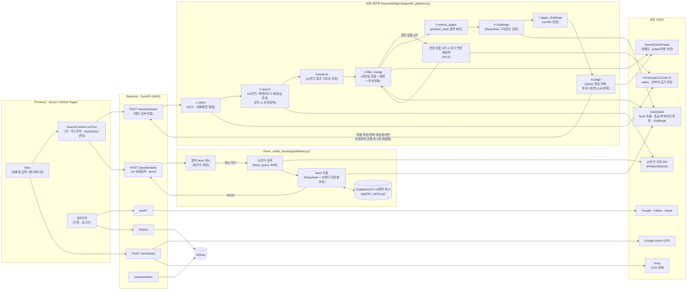
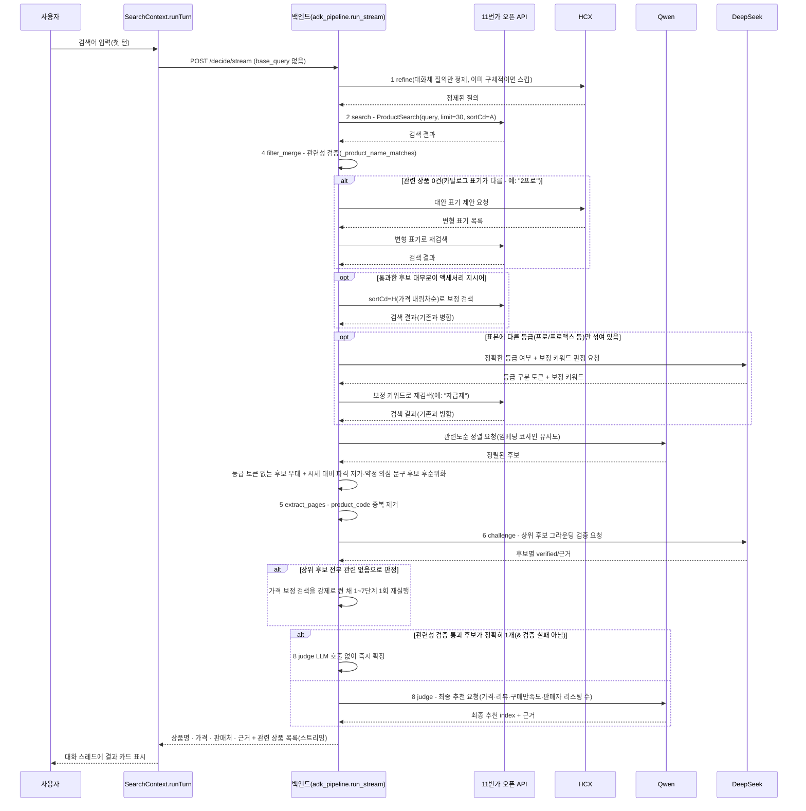

# αlpha Pick

alpha-pick-jet.vercel.app

---

## 1️⃣ 프로젝트 개요

### 프로젝트명 및 한 줄 소개

**αlpha Pick** — 검색어를 11번가 오픈 API의 실측 구조화 데이터로 검증하고, AI 추천 Agent가 가격·리뷰·구매만족도를 종합해 근거와 함께 하나의 답으로 압축해주는 쇼핑 가격비교 서비스.

### 프로젝트 개요도

> 검색어를 11번가 오픈 API(ProductSearch, 1st-party 구조화 데이터)로 검증하고,
> Google ADK **8단계 `SequentialAgent`**가 refine → 검색 → propose(11번가 결과를
> 그대로 후보로 포장) → filter_merge(관련성 검증 + 랭킹 + 의심 후보 후순위화) →
> extract_pages(중복 제거) → challenge(DeepSeek 그라운딩 검증) → apply_challenge
> → judge(최종 선택)를 ADK의 상태 관리·재시도·캐시 콜백으로 감싼다. 각 단계의
> 모델/프롬프트/규칙 기반 로직은 [파이프라인 단계별 상세](#파이프라인-단계별-상세)
> 참고. Human-in-the-loop은 텍스트 재검색 대신 구조적 로컬 필터링으로 후보군을
> 좁혀나간다.

### 적용 기술 스택

| 영역 | 스택 |
| --- | --- |
| Frontend | React 18, Vite 6, TypeScript, Tailwind CSS v4, Framer Motion(`motion`), React Router (HashRouter) |
| Backend | FastAPI, Python, httpx, PyJWT |
| 검색 | 11번가 오픈 API(ProductSearch) - 1st-party 구조화 데이터, 스크래핑 없음 |
| 파이프라인 | Google ADK 8단계 `SequentialAgent`(`app/adk_pipeline.py`) - 모델·프롬프트·규칙 기반 로직은 [파이프라인 단계별 상세](#파이프라인-단계별-상세) |
| LLM 응답 캐시 | Supabase(Postgres + pgvector) 기반 KV(완전 일치) + 시맨틱(임베딩 유사도) 2단 캐시 |
| 이미지 인식 | Google Cloud Vision (텍스트 추출) → Groq (정제 · 검색어 추출) |
| 인증 | Google / Kakao / Naver OAuth2 + JWT 기반 세션 |
| 저장소 | SQLite (검색 기록 · 자동완성 인덱스), Supabase(LLM 캐시) |
| 배포 | Docker, nginx, certbot, AWS EC2(Backend) / Vercel, GitHub Pages(Frontend) |

### 주제 선정 배경

쇼핑을 위해 여러 플랫폼 탭을 오가며 가격을 직접 비교해야 하는 번거로움에서 출발했다. 단순히 최저가를 나열하는 비교 서비스가 아니라, "왜 이 상품인지" 근거를 함께 제시하는 서비스를 목표로 했고, LLM이 상품 정보 자체를 지어낼 위험(환각)을 줄이기 위해 **실측 구조화 데이터로 검증된 후보만 LLM에게 보여주고 그중에서 고르게 하는 구조**를 채택했다.

### 목표 및 기대효과

- 여러 쇼핑몰을 직접 비교하는 시간을 줄이고, 근거가 붙은 단일 추천으로 의사결정을 단순화
- LLM이 상품 정보를 지어내지 않도록, 실측 구조화 데이터로 검증된 후보만 추천 대상으로 삼아 신뢰도를 높임
- 텍스트뿐 아니라 상품 사진(OCR)으로도 검색이 가능해 입력 장벽을 낮춤

### 팀원 구성 및 역할 분담

| 팀원 | 주요 역할 |
| --- | --- |
| parkminsung45 (박민성) | 백엔드 아키텍처·검색/추천 엔진 설계, 배포/인프라, 소셜 로그인, 저장소 거버넌스, 프론트엔드 UI/UX 전반 |
| tmdals3000 (이승민) | 검색 후보 매칭·비용 최적화, AI 상세검색(멀티턴 clarify), 대화형 채팅 UI |
| lou0-ux | OCR 파이프라인, 검색 품질 안정화 |
| Seojeong Woo (우서정) | 서버 인스턴스 관리, 데이터베이스 구축, 모델 설정 트러블슈팅 |

#### parkminsung45 (박민성) — 백엔드 아키텍처 · 인프라 · 풀스택

- 검색/추천 파이프라인을 프로젝트 전 기간에 걸쳐 근본적으로 재설계 - 최종적으로 다나와 스크래핑 + Tavily 검색 + 멀티에이전트 디베이트 구조를 걷어내고, 11번가 오픈 API 단일 소스 위에 Google ADK 8단계 `SequentialAgent`(challenge 그라운딩 검증 포함)로 재구축
- 추천 Agent(임베딩 코사인 유사도 관련도 랭킹 + LLM 최종 선택, 실패 시 최저가 규칙 폴백) 설계·구현
- HITL 되묻기 흐름을 "질의 재구성 후 재검색" 방식에서 "구조적 로컬 필터링" 방식으로 재설계해 중복 검색 비용 제거
- Google/Kakao/Naver 소셜 로그인(OAuth) 백엔드·프론트엔드 전체 구현
- AWS EC2 + Docker + nginx/TLS 백엔드 배포, GitHub Pages/Vercel 프론트엔드 배포 파이프라인 구축
- LLM 프로바이더 다중화 관리: OpenAI → Gemini/Claude → Groq → Qwen/DeepSeek/HCX로 이어지는 모델 슬롯 교체·비용/속도 튜닝
- GitHub 저장소 거버넌스 구성, 대규모 죽은 코드 정리를 여러 차례 주도

#### tmdals3000 (이승민) — 검색 정확도 · 비용 최적화 · 대화형 UX

- 검색어 자동완성(cold-start) 기능 구현
- 후보 매칭 정확도 개선: 사양 표기 차이로 인한 오매칭을 막는 계열(family) 기반 가드 설계, exclusive-token 가드로 동일 단어·다른 상품 오매칭 방지
- LLM 비용/응답속도 최적화 주도
- AI 상세검색(멀티턴 facet 되묻기) 기능 설계 및 지속 개선(facet 자동 제출, 대화체 질의 정제, 드릴다운 검색어 정리)
- 채팅형 UI(메시지 타임스탬프, 재시도, 수정 기능) 구현
- 신뢰 신호(동일 판매자 리스팅 수 · 시세 중앙값 대비 저가 · 약정 의심 문구) 기반 의심 후보 후순위화 설계·구현

#### lou0-ux — OCR 파이프라인 · 검색 품질 안정화

- Google Cloud Vision 기반 OCR 텍스트 추출 파이프라인 최초 구현
- OCR 정제 실패 시 규칙 기반 폴백 체인 설계
- 핸드폰 케이스 등 액세서리 카테고리에서 무관한 상품이 섞이는 검색 품질 문제 수정
- 최종 결과 카드 UX 실험 및 11번가 오픈 API 스모크 테스트 스크립트 작성

#### Seojeong Woo (우서정) — 인프라 · 모델 설정 관리

- 서버 인스턴스 관리, 데이터베이스 구축 및 기술 리서치
- 모델 기본값 설정 오류 수정, 불필요한 LLM 재시도 로직 제거로 응답 지연시간 단축

### 개발 이력 요약

프로젝트는 세 번의 큰 재설계를 거쳤다.

1. **초기(~08-10)**: GPT/Gemini/DeepSeek 멀티에이전트 구매 의사결정 엔진 + 소셜 로그인/OCR/AWS 배포 최초 구축
2. **중기(08-11~08-19)**: Google ADK 기반 역할 분리 멀티에이전트 파이프라인(다나와 실측가 + Tavily 검색 + 3모델 병렬 제안 + 심사) + Human-in-the-loop 되묻기 도입, 다나와/쿠팡/네이버쇼핑 교차 검증으로 그라운딩 강화
3. **현재(08-20~)**: 다나와 스크래핑 + Tavily 검색 + 멀티에이전트 디베이트 전체를 걷어내고 **11번가 오픈 API 단일 소스**로 통일. 이후 Google ADK를 그 위에 **8단계 `SequentialAgent`**로 재도입(challenge 그라운딩 검증 포함), 액세서리 도배·등급 편중 감지·의심 후보 후순위화 등 검색 품질 보정을 반복 추가

날짜별 상세 커밋 이력은 `git log`로 확인 가능하다. 아래 섹션들은 **현재 구조**를 기준으로 설명하고, 과거에 썼다가 제거된 컴포넌트(다나와, Tavily, Google Merchant, Gemini/Claude, 쿠팡·네이버쇼핑 교차확인 등)는 이 문서에서 더 다루지 않는다.

### 주요 트러블슈팅 (최근 · 현재 아키텍처 기준)

- **검색 결과가 액세서리로 도배됨**("아이폰 17" 검색에 케이스/충전기만 뜸): 11번가가 항상 가격 오름차순(`sortCd=A`) 고정이라, 액세서리 판매자들이 저가 SKU를 대량 등록하면 본품이 표본 밖으로 밀려남 → 액세서리 지시어 비율이 높으면 `sortCd=H`(가격 내림차순) 보정 검색을 추가로 붙여 병합(`most_candidates_look_like_accessories` 키워드 트리거 + `looks_accessory_flooded` DeepSeek 의미 재확인 2단 게이트)
- **등급 편중**("아이폰 17"/"아이폰 16" 검색에 프로/프로맥스만 뜨고 기본형이 안 나옴): 프로/프로맥스 매물이 가격 양극단 표본을 압도해 기본형이 아예 안 걸림 → DeepSeek이 표본에 다른 등급이 섞였는지 항상 판정하고, 없으면 카테고리별 보정 키워드(휴대폰류 "자급제" 등)로 재검색, 랭킹에서도 그 등급 토큰이 없는 후보를 우대, judge 프롬프트에도 "[다른 등급]" 표시로 명시(자세한 내용은 [파이프라인 단계별 상세](#파이프라인-단계별-상세) 참고)
- **AI 상세검색에 액세서리 카테고리가 되묻기 옵션으로 뜸**: facet 옵션 값 자체에 액세서리 지시어(케이스/충전기/어댑터 등)가 있으면 라벨 이름과 무관하게 걸러내도록 수정(`_strip_accessory_options`)
- **judge가 challenge 검증 결과를 못 보고 최종 추천을 고름**("골프공" 검색에 "골프파우치"가 최종 추천으로 뜸): judge 프롬프트에 challenge의 `verified`/`challenge_note`를 명시적으로 전달하도록 연결
- **HCX가 가격/약정 의심 경고 문구를 무시하고 최저가만 선택**: 프롬프트 경고 대신 코드에서 의심 후보(시세 중앙값 대비 파격 저가, "미개봉"/"완납" 문구)의 순서 자체를 뒤로 재배열(`deprioritize_suspicious`)
- **challenge를 규칙 기반으로 대체할 수 있는지 검증**: 골든셋 50개 라이브 실측 결과, 전체 후보의 24.6%가 challenge에서 검증 실패로 판정됐고 그중 65%는 규칙 사전으로는 못 잡는 순수 의미 판단("갤럭시 S25 FE"를 "갤럭시 S25"와 다른 모델로 구분 등) - challenge는 현행 유지

---

## 2️⃣ Project 과정 기록

### 데이터 소스 및 탐색

- **검색 데이터**: 11번가 오픈 API(ProductSearch)로 실시간 조회 - 1st-party 구조화 XML 응답(상품명 · 가격 · 판매자 · 리뷰 수 · 구매만족도 · 상세 URL이 필드로 분리돼 있어, 스크래핑처럼 스니펫에서 오파싱할 위험이 없음)
- **카테고리 데이터**: 조회하지 않는다 - 11번가가 카테고리 코드 필터를 지원하지 않아(dispCtgrNo를 줘도 결과가 안 바뀜을 실측 확인) 카테고리 축은 아예 다루지 않는다. AI 상세검색의 "카테고리" facet은 DeepSeek이 상품명에서 자체적으로 뽑아온 걸 의도적으로 걸러낸다
- **이미지 데이터**: 사용자가 업로드한 상품 사진 → Google Cloud Vision으로 텍스트 추출

### 전처리(검색 결과 정제) 방법

- 관련성 검증(`_product_name_matches`): 토큰 유사도(rapidfuzz) + 모델/규격 토큰 충돌 가드 + 상호배타 토큰 가드 + 액세서리 오매칭 가드 4단 - 검색어와 실제로 같은 상품인지 확인된 후보만 남김
- 검색어 표기가 카탈로그와 달라(예: "2프로") 1차 검색이 관련 상품을 하나도 못 찾으면, HCX가 대안 표기를 제안해 재검색
- OCR 원문에서 가격/바코드/프로모션 문구를 제거하고 상품명·용량 등 핵심 메타데이터만 남기는 Groq 정제 단계(`search_query` 추출)

### 평가 기준 (무엇으로 "좋은 답"을 판단할지)

- 실제 판매 중인 상품 페이지 URL인지 (목록/콘텐츠 페이지 배제)
- 검색어의 브랜드·상품과 실제 반환된 상품이 일치하는지
- 최종 추천에 가격·판매처·선정 근거가 모두 포함되는지

### 베이스라인 대비 개선

LLM에게 상품 정보를 통째로 맡기는 방식(베이스라인, 존재하지 않는 상품·가격을 지어낼 위험이 있음) 대비, 후보 자체를 11번가 오픈 API의 실측 구조화 데이터로만 구성하고 규칙 기반 관련성 검증을 먼저 거치도록 설계했다. LLM(추천 Agent)은 이미 검증된 후보 중에서 고르기만 해 그라운딩이 안 된 답을 낼 수가 없고, 실패해도 최저가 규칙 기반으로 안전하게 폴백한다.

### 아키텍처 (11번가 단일 소스 · ADK 8단계 SequentialAgent)

짧고 애매한 검색어(예: "핸드폰")는 위 흐름 전에 `POST /decide/clarify`(11번가 검색 결과
기반 동적 facet, DeepSeek)를 먼저 시도한다 - 카테고리 축은 되묻지 않고, 드릴다운
후속 턴(`base_query`가 있는 턴)은 매번 재검색하는 대신 `base_query`로 한 번만 검색한
결과를 로컬 필터링(`_filter_items_by_extra_terms`)으로 좁혀나간다. facet을 못 찾으면
그대로 `/decide/stream` 경로로 넘어간다.

### 파이프라인 단계별 상세

8단계 각각에서 **어떤 모델을 쓰는지, 프롬프트가 무슨 역할을 하는지, 어디까지가
규칙(코드) 기반인지**를 정리한다. 실제 프롬프트 전문/코드는 각 파일 참고 - 여기서는
"무엇을 어떤 방식으로 판단하는가"만 설명한다.

| # | 단계 | 모델 | LLM 호출 시점 | 프롬프트 역할 | 규칙 기반(코드) 로직 |
| --- | --- | --- | --- | --- | --- |
| 1 | **refine** | HCX(`HCX-DASH-002`) | 질의가 대화체("~하고 싶어" 등)일 때만 | 대화체 질의에서 실제 검색어만 뽑아 정제(예: "저렴한 아기 간식을 사고 싶어" → "아기 간식") | 정규식(`looks_conversational_query`)으로 이미 짧고 구체적인 질의는 LLM 호출 자체를 건너뜀. 가격 조건("2만원대")은 LLM 이전에 정규식으로 먼저 분리 |
| 2 | **search** | (기본) 없음, 조건부 DeepSeek | 액세서리 도배 또는 등급 편중이 감지될 때만 | ① 액세서리 도배 의심: "이 후보 목록에 본품이 있는가" 판정 ② 등급 편중: "표본에 정확한 등급이 있는가, 없으면 어떤 보정 키워드로 재검색해야 하는가" 판정(카테고리마다 다른 키워드를 LLM이 직접 제안, 하드코딩 아님) | 11번가 `ProductSearch`(`sortCd=A` 가격 오름차순) 30개 검색이 기본. 액세서리 지시어 사전 매칭(`most_candidates_look_like_accessories`)이 1차 게이트라 대부분의 검색은 LLM 호출 없이 끝남 - 걸린 경우만 `sortCd=H` 보정 검색 |
| 3 | **propose** | 없음 | - | - | 11번가 검색 결과를 그대로 후보 풀로 포장(단일 소스라 LLM 추정 자체가 불필요) |
| 4 | **filter_merge** | Qwen(임베딩), 조건부 HCX | 항상(임베딩 정렬), 관련 상품 0건일 때만(HCX 표기 변형) | 표기 변형: 카탈로그 표기가 다른 경우("2프로"↔"이프로") 대안 검색어 제안 | 관련성 검증(rapidfuzz 유사도 + 모델/규격 토큰 충돌 + 배타 토큰 + 액세서리 오매칭, 전부 규칙)이 먼저 걸러내고, 통과한 후보만 Qwen 임베딩(`text-embedding-v3`) 코사인 유사도로 랭킹. 등급 토큰 없는 후보 우대, 의심 후보(중앙값 대비 파격 저가·약정 의심 문구) 후순위화는 둘 다 순수 코드 |
| 5 | **extract_pages** | 없음 | - | - | `product_code` 기준 중복 제거(먼저 나온, 더 관련도 높은 쪽을 유지) |
| 6 | **challenge** | DeepSeek(`deepseek-chat`) | 상위 최대 10개 후보에 대해 항상 | 규칙 필터를 통과한 후보가 "표기만 비슷할 뿐 실제로는 다른 상품"인지 의미 기반으로 재검증(예: 액세서리, 다른 브랜드/모델) | 명백한 액세서리 지시어가 상품명에 있는데 challenge가 놓치면 규칙으로 강제 `verified=False` 오버라이드(LLM이 프롬프트의 "애매하면 true로" 지시를 과하게 적용하는 걸 실측 확인) |
| 7 | **apply_challenge** | 없음 | - | - | challenge 판정(`verified`/`challenge_note`)을 후보 목록에 index 기준으로 반영 |
| 8 | **judge** | Qwen(`qwen3.7-plus`), 조건부 스킵 | 관련성 검증 통과 후보가 2개 이상이거나, 1개여도 challenge에서 검증 실패로 나왔을 때만 | 가격·리뷰 수·구매만족도·동일 판매자 리스팅 수를 종합해 최종 추천 하나 선택, "[검증 실패: ...]"/"[다른 등급]" 표시가 있는 후보는 그런 표시가 없는 후보가 있는 한 피하도록 지시 | 후보가 정확히 1개고 검증도 통과했으면 LLM 호출 없이 즉시 확정(`_skip_judge_if_single_candidate`). 실패 시 최저가 규칙 기반 폴백 |

> 위 표는 실제 라이브 경로(`/decide`, `/decide/stream` → `adk_pipeline`)만
> 다룬다. 로컬 실험 전용인 `/decide/elevenst-only`(프론트 미사용, `debate.py`의
> `run_elevenst_only_debate`)는 challenge 단계 자체가 없는 더 단순한 선형
> 버전이고, refine도 다른 함수(`gpt.refine_query`)를 쓴다 - `agent="gpt"`
> 식별자와 파일명 `gpt.py`는 원래 이 슬롯이 Qwen을 호출하던 시절의 흔적이고,
> 지금은 의도적으로 HCX(`HCX-005`, 위 refine 단계가 쓰는 `HCX-DASH-002`와는
> 다른 모델)를 호출한다 - 한국어 표현 이해도와 효용성이 더 낫다고 판단해
> 채택한 것으로, Qwen 쿼터 문제로 인한 임시 조치가 아니다. 같은 이유로 이
> 경로의 최종 추천(judge에 해당하는 `recommend_best`)도 HCX다.

**모델별 호출 목적 요약**

| 모델 | 이 프로젝트에서의 역할 |
| --- | --- |
| **Qwen**(DashScope) | 임베딩(`text-embedding-v3`, 관련도 랭킹) + judge(최종 추천 선택) |
| **DeepSeek** | AI 상세검색 facet 추출 + challenge(그라운딩 검증) + 액세서리 도배/등급 편중 의미 판정 |
| **HCX**(HyperCLOVA X) | 대화체 질의 정제(refine) + 검색어 표기 변형 제안 |
| **Groq** | OCR 결과 정제(가격/바코드 제거, 검색어 추출) |
| **Google Cloud Vision** | 이미지 OCR 텍스트 추출 |

### 성능/품질 개선 기록

- 관련성 검증 4단 가드(rapidfuzz 유사도 + 모델/규격 토큰 충돌 + 배타 토큰 + 액세서리 오매칭)로 그라운딩 안 된 후보를 LLM 이전 단계에서 원천 차단
- Qwen "thinking mode"(내부 추론 과정을 다 생성한 뒤에야 응답 반환) 비활성화로 응답 지연 20~95초 → 2~5초 단축
- 신뢰 신호(동일 판매자 리스팅 수 · 시세 중앙값 대비 저가 · 약정 의심 문구) 기반 의심 후보 후순위화 - 프롬프트 경고만으로는 LLM이 무시하는 걸 실측해 코드 레벨 재정렬로 전환
- 액세서리 도배·등급 편중 2종 모두 "키워드/사전 1차 게이트 → 놓친 경우만 LLM 의미 판정" 구조로 설계해 평소 검색 속도/비용에는 영향 없이 커버리지만 확장
- judge 단계에 후보 1개 스킵 로직 추가로 불필요한 LLM 호출 제거
- 골든셋 50개(10카테고리×5) 라이브 실측으로 challenge 단계의 실효성을 정량 검증(24.6%가 실제 검증 실패, 그중 65%는 규칙으로 불가능한 판단)

### 한계점 및 향후 과제

- 카카오 로그인은 REST API 키 설정을 완료했으나, 실사용 트래픽 기준의 검증은 아직 진행 전
- 정성적 검증 위주로 진행되어, 정량적 지표(응답 정확도·지연 시간 등) 기반의 자동화된 평가 체계는 부재(골든셋 50개 1회성 실측은 있었으나 상시 회귀 하네스는 아님)
- 검색 범위가 11번가 하나뿐 - 다른 오픈마켓도 구조화 API를 제공하면 같은 패턴(`fetchers/elevenst.py`)으로 확장 가능
- 11번가 오픈 API가 카테고리 코드 필터를 지원하지 않아, AI 상세검색의 카테고리 축은 사용자에게 되묻지 않고 표본을 좁히는 데도 안 씀
- HCX 검색어 표기 변형 재검색은 1차 검색 실패 시에만 타는 폴백이라 평소 검색 속도에는 영향 없지만, 그 경로 자체는 추가 LLM 호출 + 재검색으로 몇 초 더 걸림
- 11번가 오픈 API 자체의 검색 결과 비결정성(같은 질의도 호출마다 표본이 크게 달라짐)이 반복 관측됨 - 골든셋 50개 중 14%가 API 응답 자체 실패
