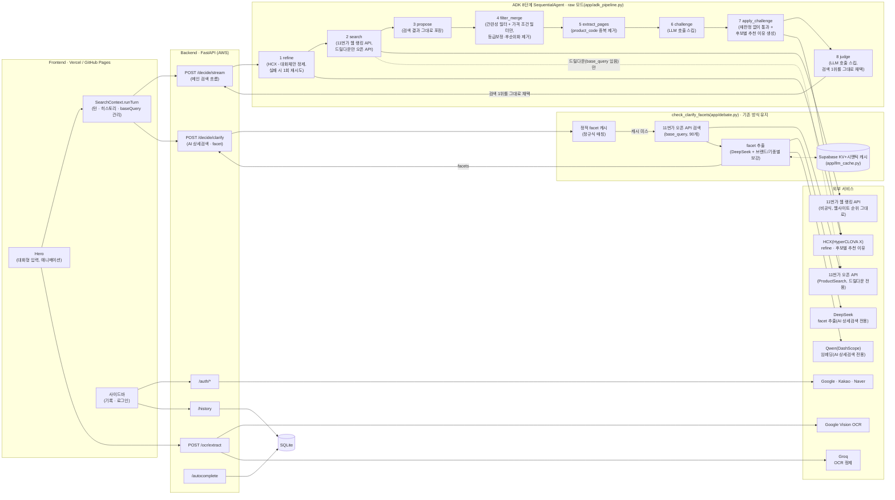
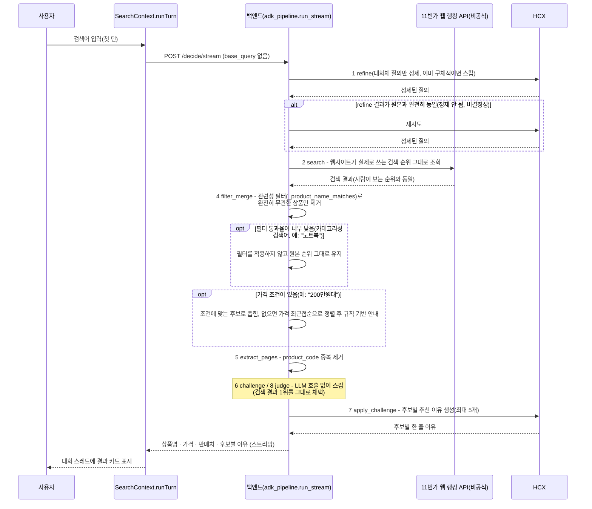

# αlpha Pick

alpha-pick-jet.vercel.app

---

## 1️⃣ 프로젝트 개요

### 프로젝트명 및 한 줄 소개

**αlpha Pick** — 검색어를 11번가 실측 데이터로 검증하고, 판단 없이 실제 웹사이트 검색 순위를 그대로 반영해 근거와 함께 하나의 답으로 압축해주는 쇼핑 가격비교 서비스.

### 프로젝트 개요도

> 검색어를 HCX로 정제한 뒤, **11번가 웹사이트가 실제로 쓰는 검색 순위(비공식
> 내부 API)** 를 그대로 가져온다. Google ADK **8단계 `SequentialAgent`** 구조
> (refine → search → propose → filter_merge → extract_pages → challenge →
> apply_challenge → judge)는 유지하되, 2026-08-27 재구성으로 **challenge·judge·
> 등급 보정 재검색을 걷어내고 "판단 없이 그대로" 흐르는 raw 모드**로 바뀌었다.
> 오픈 API(`ProductSearch`)의 정렬이 실제 웹사이트 순위와 달라(액세서리가
> 상단을 차지) 검색 소스 자체를 웹사이트 내부 API로 교체했고, 완전히 무관한
> 상품을 거르는 관련성 필터와 가격 조건 필터만 최소한으로 남겼다. 각 단계의
> 세부 사항은 [파이프라인 단계별 상세](#파이프라인-단계별-상세) 참고.
> Human-in-the-loop(AI 상세검색)은 이 변경과 무관하게 기존 방식(공식 오픈
> API + 구조적 로컬 필터링) 그대로다.

### 적용 기술 스택

| 영역 | 스택 |
| --- | --- |
| Frontend | React 18, Vite 6, TypeScript, Tailwind CSS v4, Framer Motion(`motion`), React Router (HashRouter) |
| Backend | FastAPI, Python, httpx, PyJWT |
| 검색 | 11번가 웹 랭킹 API(비공식, 웹사이트 실제 검색 순위) - 메인 검색 / 11번가 오픈 API(ProductSearch) - AI 상세검색 드릴다운 전용, 둘 다 스크래핑 없음 |
| 파이프라인 | Google ADK 8단계 `SequentialAgent`(`app/adk_pipeline.py`), 2026-08-27부터 판단 최소화 raw 모드 - 모델·프롬프트·규칙 기반 로직은 [파이프라인 단계별 상세](#파이프라인-단계별-상세) |
| LLM 응답 캐시 | Supabase(Postgres + pgvector) 기반 KV(완전 일치) + 시맨틱(임베딩 유사도) 2단 캐시 |
| 이미지 인식 | Google Cloud Vision (텍스트 추출) → Groq (정제 · 검색어 추출) |
| 인증 | Google / Kakao / Naver OAuth2 + JWT 기반 세션 |
| 저장소 | SQLite (검색 기록 · 자동완성 인덱스), Supabase(LLM 캐시) |
| 배포 | Docker, nginx, certbot, AWS EC2(Backend) / Vercel, GitHub Pages(Frontend) |

### 주제 선정 배경

쇼핑을 위해 여러 플랫폼 탭을 오가며 가격을 직접 비교해야 하는 번거로움에서 출발했다. 단순히 최저가를 나열하는 비교 서비스가 아니라, "왜 이 상품인지" 근거를 함께 제시하는 서비스를 목표로 했고, LLM이 상품 정보 자체를 지어낼 위험(환각)을 줄이기 위해 **실측 구조화 데이터로 검증된 후보만 LLM에게 보여주고 그중에서 고르게 하는 구조**를 채택했다.

### 목표 및 기대효과

- 여러 쇼핑몰을 직접 비교하는 시간을 줄이고, 근거가 붙은 단일 추천으로 의사결정을 단순화
- LLM이 상품 정보를 지어내지 않도록, 실측 구조화 데이터로 검증된 후보만 추천 대상으로 삼아 신뢰도를 높임
- 텍스트뿐 아니라 상품 사진(OCR)으로도 검색이 가능해 입력 장벽을 낮춤

### 팀원 구성 및 역할 분담

| 팀원 | 주요 역할 |
| --- | --- |
| parkminsung45 (박민성) | 백엔드 아키텍처·검색/추천 엔진 설계, 배포/인프라, 소셜 로그인, 저장소 거버넌스, 프론트엔드 UI/UX 전반 |
| tmdals3000 (이승민) | 검색 후보 매칭·비용 최적화, AI 상세검색(멀티턴 clarify), 대화형 채팅 UI |
| lou0-ux | OCR 파이프라인, 검색 품질 안정화 |
| Seojeong Woo (우서정) | 서버 인스턴스 관리, 데이터베이스 구축, 모델 설정 트러블슈팅 |

#### parkminsung45 (박민성) — 백엔드 아키텍처 · 인프라 · 풀스택

- 검색/추천 파이프라인을 프로젝트 전 기간에 걸쳐 근본적으로 재설계 - 최종적으로 다나와 스크래핑 + Tavily 검색 + 멀티에이전트 디베이트 구조를 걷어내고, 11번가 오픈 API 단일 소스 위에 Google ADK 8단계 `SequentialAgent`(challenge 그라운딩 검증 포함)로 재구축
- 추천 Agent(임베딩 코사인 유사도 관련도 랭킹 + LLM 최종 선택, 실패 시 최저가 규칙 폴백) 설계·구현
- HITL 되묻기 흐름을 "질의 재구성 후 재검색" 방식에서 "구조적 로컬 필터링" 방식으로 재설계해 중복 검색 비용 제거
- Google/Kakao/Naver 소셜 로그인(OAuth) 백엔드·프론트엔드 전체 구현
- AWS EC2 + Docker + nginx/TLS 백엔드 배포, GitHub Pages/Vercel 프론트엔드 배포 파이프라인 구축
- LLM 프로바이더 다중화 관리: OpenAI → Gemini/Claude → Groq → Qwen/DeepSeek/HCX로 이어지는 모델 슬롯 교체·비용/속도 튜닝
- GitHub 저장소 거버넌스 구성, 대규모 죽은 코드 정리를 여러 차례 주도

#### tmdals3000 (이승민) — 검색 정확도 · 비용 최적화 · 대화형 UX

- 검색어 자동완성(cold-start) 기능 구현
- 후보 매칭 정확도 개선: 사양 표기 차이로 인한 오매칭을 막는 계열(family) 기반 가드 설계, exclusive-token 가드로 동일 단어·다른 상품 오매칭 방지
- LLM 비용/응답속도 최적화 주도
- AI 상세검색(멀티턴 facet 되묻기) 기능 설계 및 지속 개선(facet 자동 제출, 대화체 질의 정제, 드릴다운 검색어 정리)
- 채팅형 UI(메시지 타임스탬프, 재시도, 수정 기능) 구현
- 신뢰 신호(동일 판매자 리스팅 수 · 시세 중앙값 대비 저가 · 약정 의심 문구) 기반 의심 후보 후순위화 설계·구현

#### lou0-ux — OCR 파이프라인 · 검색 품질 안정화

- Google Cloud Vision 기반 OCR 텍스트 추출 파이프라인 최초 구현
- OCR 정제 실패 시 규칙 기반 폴백 체인 설계
- 핸드폰 케이스 등 액세서리 카테고리에서 무관한 상품이 섞이는 검색 품질 문제 수정
- 최종 결과 카드 UX 실험 및 11번가 오픈 API 스모크 테스트 스크립트 작성

#### Seojeong Woo (우서정) — 인프라 · 모델 설정 관리

- 서버 인스턴스 관리, 데이터베이스 구축 및 기술 리서치
- 모델 기본값 설정 오류 수정, 불필요한 LLM 재시도 로직 제거로 응답 지연시간 단축

### 개발 이력 요약

프로젝트는 네 번의 큰 재설계를 거쳤다.

1. **초기(~08-10)**: GPT/Gemini/DeepSeek 멀티에이전트 구매 의사결정 엔진 + 소셜 로그인/OCR/AWS 배포 최초 구축
2. **중기(08-11~08-19)**: Google ADK 기반 역할 분리 멀티에이전트 파이프라인(다나와 실측가 + Tavily 검색 + 3모델 병렬 제안 + 심사) + Human-in-the-loop 되묻기 도입, 다나와/쿠팡/네이버쇼핑 교차 검증으로 그라운딩 강화
3. **08-20~08-26**: 다나와 스크래핑 + Tavily 검색 + 멀티에이전트 디베이트 전체를 걷어내고 **11번가 오픈 API 단일 소스**로 통일. 이후 Google ADK를 그 위에 **8단계 `SequentialAgent`**로 재도입(challenge 그라운딩 검증 포함), 액세서리 도배·등급 편중 감지·의심 후보 후순위화 등 검색 품질 보정을 반복 추가
4. **현재(08-27~)**: "판단 없이 검색 결과를 그대로 가져오면 된다"는 방향으로 메인 검색 경로를 **raw 모드**로 재구성 - challenge·judge·등급 보정 재검색을 제거하고, 오픈 API 정렬이 실제 웹사이트 순위와 다르다는 걸 실측으로 확인해 **11번가 웹 랭킹 API(비공식)** 로 검색 소스를 교체. 완전히 무관한 상품을 거르는 관련성 필터와 가격 조건 필터만 최소한으로 유지, 대신 후보별 추천 이유를 새로 추가

날짜별 상세 커밋 이력은 `git log`로 확인 가능하다. 최근 업데이트는 [날짜별 업데이트 사항](#날짜별-업데이트-사항)에 요약해뒀다. 아래 섹션들은 **현재 구조**를 기준으로 설명하고, 과거에 썼다가 제거된 컴포넌트(다나와, Tavily, Google Merchant, Gemini/Claude, 쿠팡·네이버쇼핑 교차확인 등)는 이 문서에서 더 다루지 않는다.

### 주요 트러블슈팅 (최근 · 현재 아키텍처 기준)

- **검색 결과가 액세서리로 도배됨**("아이폰 17" 검색에 케이스/충전기만 뜸): 11번가가 항상 가격 오름차순(`sortCd=A`) 고정이라, 액세서리 판매자들이 저가 SKU를 대량 등록하면 본품이 표본 밖으로 밀려남 → 액세서리 지시어 비율이 높으면 `sortCd=H`(가격 내림차순) 보정 검색을 추가로 붙여 병합(`most_candidates_look_like_accessories` 키워드 트리거 + `looks_accessory_flooded` DeepSeek 의미 재확인 2단 게이트)
- **등급 편중**("아이폰 17"/"아이폰 16" 검색에 프로/프로맥스만 뜨고 기본형이 안 나옴): 프로/프로맥스 매물이 가격 양극단 표본을 압도해 기본형이 아예 안 걸림 → DeepSeek이 표본에 다른 등급이 섞였는지 항상 판정하고, 없으면 카테고리별 보정 키워드(휴대폰류 "자급제" 등)로 재검색, 랭킹에서도 그 등급 토큰이 없는 후보를 우대, judge 프롬프트에도 "[다른 등급]" 표시로 명시(자세한 내용은 [파이프라인 단계별 상세](#파이프라인-단계별-상세) 참고)
- **AI 상세검색에 액세서리 카테고리가 되묻기 옵션으로 뜸**: facet 옵션 값 자체에 액세서리 지시어(케이스/충전기/어댑터 등)가 있으면 라벨 이름과 무관하게 걸러내도록 수정(`_strip_accessory_options`)
- **judge가 challenge 검증 결과를 못 보고 최종 추천을 고름**("골프공" 검색에 "골프파우치"가 최종 추천으로 뜸): judge 프롬프트에 challenge의 `verified`/`challenge_note`를 명시적으로 전달하도록 연결
- **HCX가 가격/약정 의심 경고 문구를 무시하고 최저가만 선택**: 프롬프트 경고 대신 코드에서 의심 후보(시세 중앙값 대비 파격 저가, "미개봉"/"완납" 문구)의 순서 자체를 뒤로 재배열(`deprioritize_suspicious`)
- **challenge를 규칙 기반으로 대체할 수 있는지 검증**: 골든셋 50개 라이브 실측 결과, 전체 후보의 24.6%가 challenge에서 검증 실패로 판정됐고 그중 65%는 규칙 사전으로는 못 잡는 순수 의미 판단("갤럭시 S25 FE"를 "갤럭시 S25"와 다른 모델로 구분 등) - 그럼에도 이후(08-27) "판단 없이 그대로"라는 방향이 확정되며 challenge는 결국 스킵으로 전환
- **오픈 API로 "판단 없이 그대로" 가져오니 웹사이트와 다른 상품이 뜸**("11번가에 아이폰 17 검색하면 핸드폰으로 뜨는데 API로는 왜 케이스가 뜨냐"): 오픈 API(`ProductSearch`, `sortCd=A`)의 정렬이 실제 11번가 웹사이트가 보여주는 순위와 다른 알고리즘임을 Playwright로 실측 확인(공식 브랜드관 우선 노출 등 UI 전용 로직 추정) → 웹사이트가 브라우저에서 실제로 호출하는 비공식 내부 API(`apis.11st.co.kr/search/api/tab`)를 찾아 검색 소스 자체를 교체
- **"200만원대 노트북" 같은 가격 조건이 무시됨**: `extract_price_range`의 "N만원대" 파싱이 자릿수와 무관하게 항상 9999원 폭으로 계산돼(200만원대가 200~200.9999만원이 되는 등) 조건에 맞는 후보가 사실상 없었음 → N의 자릿수에 맞춰 폭을 계산하도록 수정(2만원대=1만원 폭, 200만원대=100만원 폭)
- **refine(HCX)이 ADK 파이프라인 경로에서만 가끔 정제를 안 함**: 같은 입력을 직접 호출하면 매번 정상 정제되는데, ADK LlmAgent 경로(시스템 프롬프트 + 별도 user 메시지로 같은 텍스트가 중복 전달)에서만 원문을 그대로 반환하는 비결정성을 실측 확인 → refine 결과가 원본과 완전히 같으면 한 번 더 재시도하는 안전망 추가
- **AI 상세검색 옵션 선택 시 검색어가 중복됨**("아이폰 17을 구매하고 싶어" → "아이폰 17" 선택 시 "아이폰 17을 구매하고 싶어 17"): 프론트가 옵션을 이어붙일 때 백엔드가 이미 정제한 값이 아니라 정제 전 원문을 기준으로 삼아, 토큰 중복 제거가 제대로 안 걸림 → clarify 응답의 정제된 질의를 base로 쓰도록 수정

---

## 2️⃣ Project 과정 기록

### 데이터 소스 및 탐색

- **검색 데이터**: 11번가 오픈 API(ProductSearch)로 실시간 조회 - 1st-party 구조화 XML 응답(상품명 · 가격 · 판매자 · 리뷰 수 · 구매만족도 · 상세 URL이 필드로 분리돼 있어, 스크래핑처럼 스니펫에서 오파싱할 위험이 없음)
- **카테고리 데이터**: 조회하지 않는다 - 11번가가 카테고리 코드 필터를 지원하지 않아(dispCtgrNo를 줘도 결과가 안 바뀜을 실측 확인) 카테고리 축은 아예 다루지 않는다. AI 상세검색의 "카테고리" facet은 DeepSeek이 상품명에서 자체적으로 뽑아온 걸 의도적으로 걸러낸다
- **이미지 데이터**: 사용자가 업로드한 상품 사진 → Google Cloud Vision으로 텍스트 추출

### 전처리(검색 결과 정제) 방법

- 관련성 검증(`_product_name_matches`): 토큰 유사도(rapidfuzz) + 모델/규격 토큰 충돌 가드 + 상호배타 토큰 가드 + 액세서리 오매칭 가드 4단 - 검색어와 실제로 같은 상품인지 확인된 후보만 남김
- 검색어 표기가 카탈로그와 달라(예: "2프로") 1차 검색이 관련 상품을 하나도 못 찾으면, HCX가 대안 표기를 제안해 재검색
- OCR 원문에서 가격/바코드/프로모션 문구를 제거하고 상품명·용량 등 핵심 메타데이터만 남기는 Groq 정제 단계(`search_query` 추출)

### 평가 기준 (무엇으로 "좋은 답"을 판단할지)

- 실제 판매 중인 상품 페이지 URL인지 (목록/콘텐츠 페이지 배제)
- 검색어의 브랜드·상품과 실제 반환된 상품이 일치하는지
- 최종 추천에 가격·판매처·선정 근거가 모두 포함되는지

### 베이스라인 대비 개선

LLM에게 상품 정보를 통째로 맡기는 방식(베이스라인, 존재하지 않는 상품·가격을 지어낼 위험이 있음) 대비, 후보 자체를 11번가 실측 구조화 데이터로만 구성하고 규칙 기반 관련성 검증을 먼저 거치도록 설계했다. 최종 추천은 LLM이 다시 고르는 게 아니라(2026-08-27부터, [파이프라인 단계별 상세](#파이프라인-단계별-상세) 참고) 이미 검증된 실제 웹사이트 검색 순위 1위를 그대로 채택해, 애초에 그라운딩이 안 된 답이 나올 여지가 없다.

### 아키텍처 (11번가 단일 소스 · ADK 8단계 SequentialAgent · raw 모드)

AI 상세검색 드릴다운(`base_query`가 있는 턴)은 위 raw 모드와 별개로 **기존 방식을
그대로 유지**한다 - 11번가 오픈 API로 넓게(90개) 검색한 뒤 사용자가 고른 facet 값으로
로컬 필터링하며, 관련성 필터·가격 필터도 동일하게 거친다.

짧고 애매한 검색어(예: "핸드폰")는 위 흐름 전에 `POST /decide/clarify`(11번가 검색 결과
기반 동적 facet, DeepSeek)를 먼저 시도한다 - 카테고리 축은 되묻지 않고, 드릴다운
후속 턴은 매번 재검색하는 대신 `base_query`로 한 번만 검색한 결과를 로컬 필터링
(`_filter_items_by_extra_terms`)으로 좁혀나간다. facet을 못 찾으면 그대로
`/decide/stream` 경로로 넘어간다.

### 파이프라인 단계별 상세

2026-08-27부터 메인 검색 경로(`/decide`, `/decide/stream`)는 **raw 모드**로
동작한다 - "판단 없이 검색 결과를 그대로 가져오면 된다"는 방향에 따라
challenge·judge·등급 편중 보정 재검색을 걷어냈다. 8단계 `SequentialAgent`
구조 자체(각 단계가 노드로 존재하는 것)는 유지하되, 아래 표처럼 몇몇 단계는
LLM을 아예 호출하지 않고 통과시킨다.

| # | 단계 | 모델 | LLM 호출 시점 | 프롬프트 역할 | 규칙 기반(코드) 로직 |
| --- | --- | --- | --- | --- | --- |
| 1 | **refine** | HCX(`HCX-DASH-002`) | 질의가 대화체("~하고 싶어" 등)일 때만 | 대화체 질의에서 실제 검색어만 뽑아 정제(예: "아이폰 17을 구매하고 싶어" → "아이폰 17") | 정규식(`looks_conversational_query`)으로 이미 짧고 구체적인 질의는 LLM 호출 자체를 건너뜀. 가격 조건("200만원대")은 LLM 이전에 정규식으로 먼저 분리(자릿수에 맞춰 폭 계산). refine 결과가 원본과 완전히 같으면(정제 실패로 판단) HCX를 1회 재시도 |
| 2 | **search** | 없음 | - | - | 검색어 조건 없는 단발 질의는 **11번가 웹 랭킹 API**(비공식, 웹사이트가 브라우저에서 실제로 호출하는 내부 API)를 그대로 호출해 사람이 웹에서 보는 순위 그대로 받는다. AI 상세검색 드릴다운(`base_query` 있음)만 예외적으로 기존 11번가 오픈 API(`ProductSearch`, 90개 넓게 검색 후 로컬 필터링)를 그대로 씀 |
| 3 | **propose** | 없음 | - | - | 검색 결과를 그대로 후보 풀로 포장(LLM 추정 없음) |
| 4 | **filter_merge** | 없음 | - | - | 관련성 필터(`_product_name_matches`)로 완전히 무관한 상품(다른 모델/수량, 본품 vs 부속품)만 제거 - 단, 필터 통과율이 너무 낮으면(카테고리성 검색어, 예: "노트북 추천") 필터 자체를 건너뛰고 원본 순위 유지. 가격 조건이 있으면 범위 필터링, 조건에 맞는 게 없으면 가격 최근접순 규칙 기반 안내 |
| 5 | **extract_pages** | 없음 | - | - | `product_code` 기준 중복 제거(먼저 나온, 더 관련도 높은 쪽을 유지) |
| 6 | **challenge** | ~~DeepSeek~~ (스킵) | 호출 안 함 | - | 항상 스킵 - 노드는 파이프라인에 남아있지만 LLM 호출 자체가 안 나감 |
| 7 | **apply_challenge** | HCX(`HCX-005`) | 항상(상위 최대 5개 후보) | 각 후보가 "어떤 사람에게 왜 괜찮은 선택인지" 가격·리뷰·구매만족도·판매자 근거로 1문장씩 설명(challenge 재판정은 하지 않음, 순서·선택에 영향 없음) | HCX가 지시한 JSON 형식을 안 지키는 비결정성이 커서(리스트/딕셔너리 등 여러 변형으로 응답), 인덱스·상품명 기반 범용 폴백 파싱으로 최대한 복구 |
| 8 | **judge** | ~~Qwen~~ (스킵) | 호출 안 함 | - | 항상 스킵 - 검색 결과 1위(index=0)를 그대로 최종 추천으로 확정 |

> 위 표는 실제 라이브 경로(`/decide`, `/decide/stream` → `adk_pipeline`)만
> 다룬다. 로컬 실험 전용인 `/decide/elevenst-only`(프론트 미사용, `debate.py`의
> `run_elevenst_only_debate`)는 challenge 단계 자체가 없는 더 단순한 선형
> 버전이고, refine도 다른 함수(`gpt.refine_query`)를 쓴다 - `agent="gpt"`
> 식별자와 파일명 `gpt.py`는 원래 이 슬롯이 Qwen을 호출하던 시절의 흔적이고,
> 지금은 의도적으로 HCX(`HCX-005`)를 호출한다 - 한국어 표현 이해도와
> 효용성이 더 낫다고 판단해 채택한 것으로, Qwen 쿼터 문제로 인한 임시
> 조치가 아니다. 같은 이유로 이 경로의 최종 추천(judge에 해당하는
> `recommend_best`)도 HCX다.

**모델별 호출 목적 요약**

| 모델 | 이 프로젝트에서의 역할 |
| --- | --- |
| **HCX**(HyperCLOVA X) | 대화체 질의 정제(refine) + 후보별 추천 이유 생성(`apply_challenge`) + AI 상세검색·드릴다운 경로의 검색어 표기 변형 제안 |
| **Qwen**(DashScope) | 임베딩(`text-embedding-v3`) - AI 상세검색·드릴다운 경로의 관련도 랭킹에만 쓰임(메인 경로의 challenge/judge는 스킵돼 호출 없음) |
| **DeepSeek** | AI 상세검색 facet 추출 - 메인 경로의 challenge/등급 편중 판정은 스킵돼 호출 없음 |
| **Groq** | OCR 결과 정제(가격/바코드 제거, 검색어 추출) |
| **Google Cloud Vision** | 이미지 OCR 텍스트 추출 |

### 성능/품질 개선 기록

- 관련성 검증 4단 가드(rapidfuzz 유사도 + 모델/규격 토큰 충돌 + 배타 토큰 + 액세서리 오매칭)로 그라운딩 안 된 후보를 LLM 이전 단계에서 원천 차단
- Qwen "thinking mode"(내부 추론 과정을 다 생성한 뒤에야 응답 반환) 비활성화로 응답 지연 20~95초 → 2~5초 단축
- 신뢰 신호(동일 판매자 리스팅 수 · 시세 중앙값 대비 저가 · 약정 의심 문구) 기반 의심 후보 후순위화 - 프롬프트 경고만으로는 LLM이 무시하는 걸 실측해 코드 레벨 재정렬로 전환
- 액세서리 도배·등급 편중 2종 모두 "키워드/사전 1차 게이트 → 놓친 경우만 LLM 의미 판정" 구조로 설계해 평소 검색 속도/비용에는 영향 없이 커버리지만 확장
- judge 단계에 후보 1개 스킵 로직 추가로 불필요한 LLM 호출 제거
- 골든셋 50개(10카테고리×5) 라이브 실측으로 challenge 단계의 실효성을 정량 검증(24.6%가 실제 검증 실패, 그중 65%는 규칙으로 불가능한 판단)
- **(08-27)** challenge·judge·등급 편중 보정을 걷어내 메인 경로 LLM 호출을 5단계 → 2단계(refine, 후보별 이유 생성)로 축소, 검색 소스를 실제 웹사이트 순위와 동일한 내부 API로 교체 - 지연시간 단축과 동시에 "왜 케이스가 뜨냐" 류 불일치 문제를 구조적으로 해소

### 날짜별 업데이트 사항

최근 작업만 날짜순으로 정리한다(전체 이력은 `git log` 참고, 큰 재설계 흐름은
[개발 이력 요약](#개발-이력-요약) 참고).

**2026-08-27**
- 메인 검색 경로(`/decide`, `/decide/stream`)를 **raw 모드**로 재구성 - challenge·judge·등급 편중 보정 재검색 제거
- 검색 소스를 11번가 오픈 API에서 **웹사이트 실제 검색 순위(비공식 내부 API)** 로 교체
- 후보별 추천 이유(HCX) 생성 기능 신규 추가
- `extract_price_range`의 "N만원대" 가격 폭 계산 버그 수정(자릿수 무관하게 항상 9999원 폭이던 문제)
- refine(HCX) 비결정성 대응 재시도 로직, `candidate_notes` 응답 형식 불일치 대응 범용 파싱 추가
- AI 상세검색 옵션 선택 시 검색어 중복("아이폰 17을 구매하고 싶어 17") 버그 수정
- AI 상세검색에서 질의와 정확히 같은 facet 옵션이 사라지던 문제, 액세서리 도배 의미 판정 사각지대(관련 후보 0건일 때) 수정
- 등급 편중(프로/프로맥스만 매핑) 문제를 검색·랭킹·최종 추천 전 구간에 걸쳐 마무리 수정, `Decision.verified`가 항상 `None`이던 버그 수정
- judge 단일 후보 스킵 로직 추가, "challenge를 규칙으로 대체 가능한가" 골든셋 실측 검증(24.6% 검증 실패, 65%는 순수 의미 판단 - 결과적으로 이후 challenge 자체를 스킵하는 방향으로 정리됨)
- 랜딩페이지·README를 실제 ADK 8단계 파이프라인 기준으로 갱신

**2026-08-26**
- "아이폰 17"/"아이폰 16" 등 등급이 있는 상품 검색 시 상위 등급(프로/프로맥스)만 매핑되고 기본형이 안 잡히던 문제 최초 수정(등급 편중 감지·보정 재검색·랭킹 우대 도입)
- AI 상세검색 facet에 액세서리(케이스/충전기 등)·다른 브랜드가 섞여 나오던 문제 수정
- refine 단계를 Qwen에서 HCX로 교체
- judge가 challenge 검증 결과를 못 보고 최종 추천을 고르던 문제, challenge가 놓친 명백한 액세서리를 규칙 기반으로 재검증하는 안전망 추가
- 죽은 코드(미사용 스키마·엔드포인트) 정리

**2026-08-25**
- 메인 검색 파이프라인을 **Google ADK 8단계 `SequentialAgent`** 구조로 재구성(현재 구조의 원형)
- "2만원대로 사고 싶어" 같은 가격 조건 질의 처리, 자연어 질의 정제 대상 확대
- "Powered by"에 11번가 공식 브랜드 로고 추가, 랜딩페이지 소개 문구를 11번가 단일 소스 구조에 맞게 개편

**2026-08-24**
- 검색어 자동 정제(refine) 기능 도입, 표기 차이로 인한 검색 실패에 임베딩 기반 2차 구제 추가
- 다른 후보 각각에 대한 개별 추천 이유 기능 도입(카드 UI 순위 배지 포함)
- 체감 속도 개선 - 메인 추천 먼저 스트리밍, 다른 후보 이유는 나중에 patch
- AI 상세검색 facet 다중 선택 지원, 조건 없이 포괄적으로 검색하는 옵션 추가

**2026-08-20 ~ 08-21**
- 다나와 스크래핑 + Tavily 검색 + 멀티에이전트 디베이트 구조를 걷어내고 **11번가 오픈 API 단일 소스**로 전환(가장 큰 재설계)
- HITL(AI 상세검색)을 "쿼리 재구성 후 재검색" 방식에서 "구조적 로컬 필터링" 방식으로 재설계
- Qwen "thinking mode" 비활성화로 응답 지연 20~95초 → 2~5초 단축

### 한계점 및 향후 과제

- 카카오 로그인은 REST API 키 설정을 완료했으나, 실사용 트래픽 기준의 검증은 아직 진행 전
- 정성적 검증 위주로 진행되어, 정량적 지표(응답 정확도·지연 시간 등) 기반의 자동화된 평가 체계는 부재(골든셋 50개 1회성 실측은 있었으나 상시 회귀 하네스는 아님)
- 검색 범위가 11번가 하나뿐 - 다른 오픈마켓도 구조화 API를 제공하면 같은 패턴(`fetchers/elevenst.py`)으로 확장 가능
- 11번가 오픈 API가 카테고리 코드 필터를 지원하지 않아, AI 상세검색의 카테고리 축은 사용자에게 되묻지 않고 표본을 좁히는 데도 안 씀
- HCX 검색어 표기 변형 재검색은 1차 검색 실패 시에만 타는 폴백이라 평소 검색 속도에는 영향 없지만, 그 경로 자체는 추가 LLM 호출 + 재검색으로 몇 초 더 걸림
- 11번가 오픈 API 자체의 검색 결과 비결정성(같은 질의도 호출마다 표본이 크게 달라짐)이 반복 관측됨 - 골든셋 50개 중 14%가 API 응답 자체 실패
- 메인 검색이 쓰는 11번가 웹 랭킹 API는 **공식 문서화되지 않은 비공식 내부 API** - 11번가가 사전 공지 없이 스키마를 바꾸거나 접근을 막을 수 있음. 실패 시 빈 결과로 안전하게 폴백하도록 처리했지만, 근본적으로 통제할 수 없는 외부 의존성
- challenge/judge를 스킵하면서 "왜 이 상품을 추천했는지"에 대한 LLM 검증·최종 판단 근거는 사라짐 - 대신 붙인 후보별 추천 이유(HCX)는 선택에 영향을 주지 않는 설명용 텍스트일 뿐, 검증 장치는 아님
