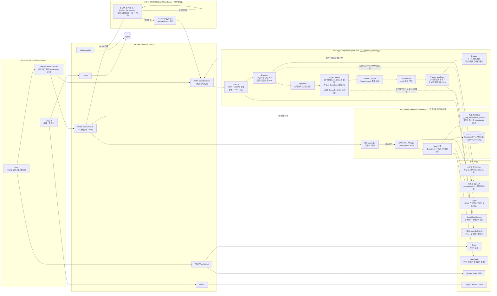
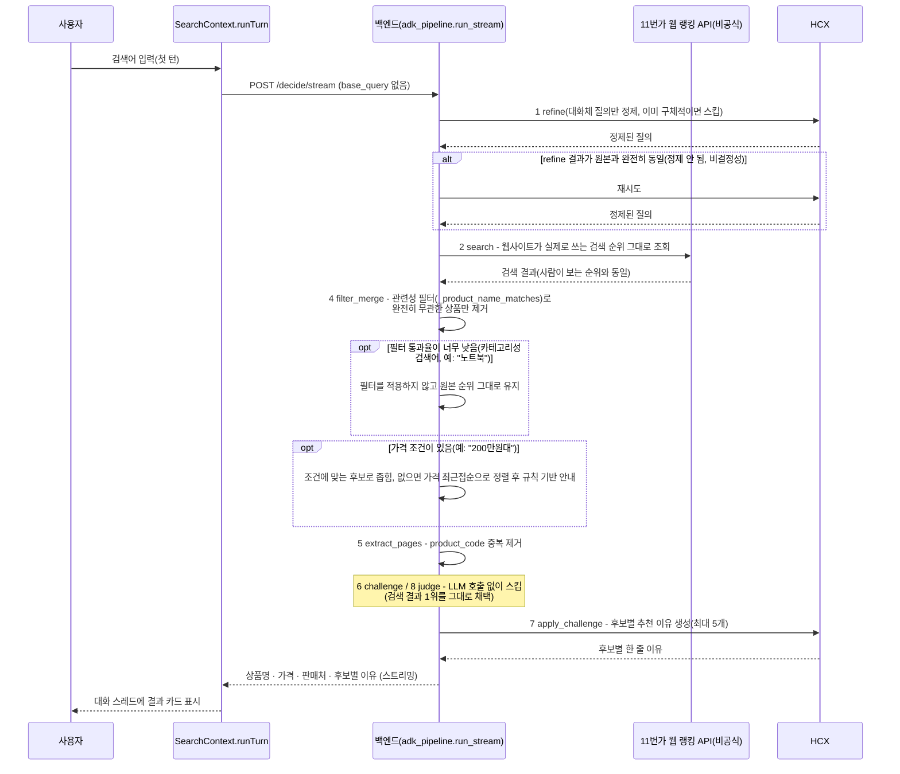
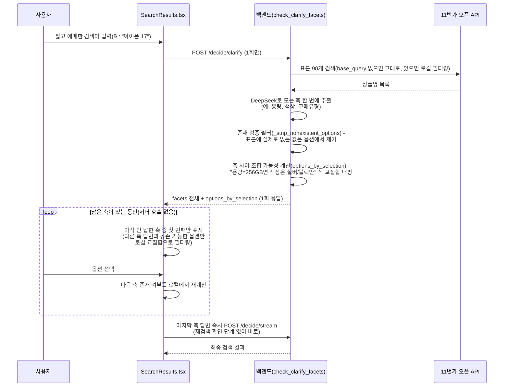

# αlpha Pick

alpha-pick-jet.vercel.app

---

## 1️⃣ 프로젝트 개요

### 프로젝트명 및 한 줄 소개

**αlpha Pick** — 검색어를 11번가 실측 데이터로 검증하고, 판단 없이 실제 웹사이트 검색 순위를 그대로 반영해 근거와 함께 하나의 답으로 압축해주는 쇼핑 가격비교 서비스.

### 프로젝트 개요도

> 검색어를 HCX로 정제한 뒤, **11번가 웹사이트가 실제로 쓰는 검색 순위(비공식
> 내부 API)** 를 그대로 가져온다. Google ADK **8단계 `SequentialAgent`** 구조
> (refine → search → propose → filter_merge → extract_pages → challenge →
> apply_challenge → judge)는 유지하되, 2026-08-27 재구성으로 **challenge·judge·
> 등급 보정 재검색을 걷어내고 "판단 없이 그대로" 흐르는 raw 모드**로 바뀌었다.
> 오픈 API(`ProductSearch`)의 정렬이 실제 웹사이트 순위와 달라(액세서리가
> 상단을 차지) 검색 소스 자체를 웹사이트 내부 API로 교체했고, 완전히 무관한
> 상품을 거르는 관련성 필터와 가격 조건 필터만 최소한으로 남겼다. 각 단계의
> 세부 사항은 [파이프라인 단계별 상세](#파이프라인-단계별-상세) 참고.
> Human-in-the-loop(AI 상세검색)은 **2026-08-28에 재검색 없는 순수 순차
> 구조로 재설계**됐다 - 첫 되묻기 응답이 필요한 축(예: 용량→색상→구매유형)
> 전체와 축 사이 조합 가능성을 한 번에 담아 내려주고, 이후로는 서버
> 왕복 없이 프론트가 로컬 연산만으로 다음 축을 좁혀 보여주다 마지막 축을
> 답하는 즉시 최종 검색으로 넘어간다. 되묻기 축 표시 순서도 본품 검색은
> 브랜드 우선, 액세서리 검색(케이스 등)은 기종 우선으로 갈라지도록
> 조건부 정렬한다. 자세한 내용은
> [AI 상세검색: 순차 HITL 재설계](#ai-상세검색-순차-hitl-재설계) 참고.
> raw 모드에서 구조적 관련성 필터가 스스로 판단을 포기하는 좁은 경우(카테고리성
> 검색어, 표기 차이)에는 DeepSeek 의미 재필터링 → 수량/브랜드 우선순위 재정렬 →
> (11번가 표본에 브랜드 상품이 아예 없으면) 다나와 보조 검증까지 이어지는 안전망을
> 2026-08-28에 추가했다 - 1000개 라이브 벤치마크 재조사로 실측 발견한 오매칭
> 패턴에 대응한 것으로, [성능/품질 개선 기록](#성능품질-개선-기록) 참고.

### 적용 기술 스택

| 영역 | 스택 |
| --- | --- |
| Frontend | React 18, Vite 6, TypeScript, Tailwind CSS v4, Framer Motion(`motion`), React Router (HashRouter) |
| Backend | FastAPI, Python, httpx, PyJWT |
| 검색 | 11번가 웹 랭킹 API(비공식, 웹사이트 실제 검색 순위) - 메인 검색 / 11번가 오픈 API(ProductSearch) - AI 상세검색 드릴다운 전용 / 다나와(search.danawa.com, HTML 스크래핑) - 11번가 표본에 질의 브랜드 상품이 없을 때만 호출되는 보조 검증 소스 |
| 파이프라인 | Google ADK 8단계 `SequentialAgent`(`app/adk_pipeline.py`), 2026-08-27부터 판단 최소화 raw 모드 - 모델·프롬프트·규칙 기반 로직은 [파이프라인 단계별 상세](#파이프라인-단계별-상세) |
| LLM 응답 캐시 | Supabase(Postgres + pgvector) 기반 KV(완전 일치) + 시맨틱(임베딩 유사도) 2단 캐시 |
| 이미지 인식 | Google Cloud Vision (텍스트 추출) → Groq (정제 · 검색어 추출) |
| 인증 | Google / Kakao / Naver OAuth2 + JWT 기반 세션 |
| 저장소 | SQLite (검색 기록 · 자동완성 인덱스), Supabase(LLM 캐시) |
| 배포 | Docker, nginx, certbot, AWS EC2(Backend) / Vercel, GitHub Pages(Frontend) |

### 주제 선정 배경

쇼핑을 위해 여러 플랫폼 탭을 오가며 가격을 직접 비교해야 하는 번거로움에서 출발했다. 단순히 최저가를 나열하는 비교 서비스가 아니라, "왜 이 상품인지" 근거를 함께 제시하는 서비스를 목표로 했고, LLM이 상품 정보 자체를 지어낼 위험(환각)을 줄이기 위해 **실측 구조화 데이터로 검증된 후보만 LLM에게 보여주고 그중에서 고르게 하는 구조**를 채택했다.

### 목표 및 기대효과

- 여러 쇼핑몰을 직접 비교하는 시간을 줄이고, 근거가 붙은 단일 추천으로 의사결정을 단순화
- LLM이 상품 정보를 지어내지 않도록, 실측 구조화 데이터로 검증된 후보만 추천 대상으로 삼아 신뢰도를 높임
- 텍스트뿐 아니라 상품 사진(OCR)으로도 검색이 가능해 입력 장벽을 낮춤

### 팀원 구성 및 역할 분담

| 팀원 | 주요 역할 |
| --- | --- |
| parkminsung45 (박민성) | 백엔드 아키텍처·검색/추천 엔진 설계, 배포/인프라, 소셜 로그인, 저장소 거버넌스, 프론트엔드 UI/UX 전반 |
| tmdals3000 (이승민) | 검색 후보 매칭·비용 최적화, AI 상세검색(멀티턴 clarify), 대화형 채팅 UI |
| lou0-ux | OCR 파이프라인, 검색 품질 안정화 |
| Seojeong Woo (우서정) | 서버 인스턴스 관리, 데이터베이스 구축, 모델 설정 트러블슈팅 |

#### parkminsung45 (박민성) — 백엔드 아키텍처 · 인프라 · 풀스택

- 검색/추천 파이프라인을 프로젝트 전 기간에 걸쳐 근본적으로 재설계 - 최종적으로 다나와 스크래핑 + Tavily 검색 + 멀티에이전트 디베이트 구조를 걷어내고, 11번가 오픈 API 단일 소스 위에 Google ADK 8단계 `SequentialAgent`(challenge 그라운딩 검증 포함)로 재구축
- 추천 Agent(임베딩 코사인 유사도 관련도 랭킹 + LLM 최종 선택, 실패 시 최저가 규칙 폴백) 설계·구현
- HITL 되묻기 흐름을 "질의 재구성 후 재검색" 방식에서 "구조적 로컬 필터링" 방식으로 재설계해 중복 검색 비용 제거
- Google/Kakao/Naver 소셜 로그인(OAuth) 백엔드·프론트엔드 전체 구현
- AWS EC2 + Docker + nginx/TLS 백엔드 배포, GitHub Pages/Vercel 프론트엔드 배포 파이프라인 구축
- LLM 프로바이더 다중화 관리: OpenAI → Gemini/Claude → Groq → Qwen/DeepSeek/HCX로 이어지는 모델 슬롯 교체·비용/속도 튜닝
- GitHub 저장소 거버넌스 구성, 대규모 죽은 코드 정리를 여러 차례 주도

#### tmdals3000 (이승민) — 검색 정확도 · 비용 최적화 · 대화형 UX

- 검색어 자동완성(cold-start) 기능 구현
- 후보 매칭 정확도 개선: 사양 표기 차이로 인한 오매칭을 막는 계열(family) 기반 가드 설계, exclusive-token 가드로 동일 단어·다른 상품 오매칭 방지
- LLM 비용/응답속도 최적화 주도
- AI 상세검색(멀티턴 facet 되묻기) 기능 설계 및 지속 개선(facet 자동 제출, 대화체 질의 정제, 드릴다운 검색어 정리)
- 채팅형 UI(메시지 타임스탬프, 재시도, 수정 기능) 구현
- 신뢰 신호(동일 판매자 리스팅 수 · 시세 중앙값 대비 저가 · 약정 의심 문구) 기반 의심 후보 후순위화 설계·구현

#### lou0-ux — OCR 파이프라인 · 검색 품질 안정화

- Google Cloud Vision 기반 OCR 텍스트 추출 파이프라인 최초 구현
- OCR 정제 실패 시 규칙 기반 폴백 체인 설계
- 핸드폰 케이스 등 액세서리 카테고리에서 무관한 상품이 섞이는 검색 품질 문제 수정
- 최종 결과 카드 UX 실험 및 11번가 오픈 API 스모크 테스트 스크립트 작성

#### Seojeong Woo (우서정) — 인프라 · 모델 설정 관리

- 서버 인스턴스 관리, 데이터베이스 구축 및 기술 리서치
- 모델 기본값 설정 오류 수정, 불필요한 LLM 재시도 로직 제거로 응답 지연시간 단축

### 개발 이력 요약

프로젝트는 다섯 번의 큰 재설계를 거쳤다.

1. **초기(~08-10)**: GPT/Gemini/DeepSeek 멀티에이전트 구매 의사결정 엔진 + 소셜 로그인/OCR/AWS 배포 최초 구축
2. **중기(08-11~08-19)**: Google ADK 기반 역할 분리 멀티에이전트 파이프라인(다나와 실측가 + Tavily 검색 + 3모델 병렬 제안 + 심사) + Human-in-the-loop 되묻기 도입, 다나와/쿠팡/네이버쇼핑 교차 검증으로 그라운딩 강화
3. **08-20~08-26**: 다나와 스크래핑 + Tavily 검색 + 멀티에이전트 디베이트 전체를 걷어내고 **11번가 오픈 API 단일 소스**로 통일. 이후 Google ADK를 그 위에 **8단계 `SequentialAgent`**로 재도입(challenge 그라운딩 검증 포함), 액세서리 도배·등급 편중 감지·의심 후보 후순위화 등 검색 품질 보정을 반복 추가
4. **08-27**: "판단 없이 검색 결과를 그대로 가져오면 된다"는 방향으로 메인 검색 경로를 **raw 모드**로 재구성 - challenge·judge·등급 보정 재검색을 제거하고, 오픈 API 정렬이 실제 웹사이트 순위와 다르다는 걸 실측으로 확인해 **11번가 웹 랭킹 API(비공식)** 로 검색 소스를 교체. 완전히 무관한 상품을 거르는 관련성 필터와 가격 조건 필터만 최소한으로 유지, 대신 후보별 추천 이유를 새로 추가
5. **08-28**: AI 상세검색(HITL)을 "축마다 재검색해서 다음 축을 되묻는" fallback 구조에서 **재검색 없는 순수 순차 구조**로 재설계 - 첫 되묻기 호출 한 번으로 축 전체를 받아오고, 이후로는 프론트 로컬 연산만으로 진행해 마지막 축 답변 즉시 최종 검색. DeepSeek이 표본에 없는 값을 지어내는 hallucination을 걸러내는 존재 검증 필터, `adk_pipeline`의 refine 재시도 게이트가 정상 검색어의 공백을 지우던 회귀를 함께 수정. 10개 카테고리 100개 유스케이스로 실측 검증
6. **현재(08-28~)**: raw 모드 전환(3번 항목) 이후 실제로 얼마나 개선됐는지 확인하기 위해 08-26 커밋(challenge/judge 실호출) 대비 **1000개 라이브 벤치마크**를 진행 - 레이턴시 45% 단축, 토큰 사용량 67% 절감, 실패율 15.1% → 0%를 실측 확인했다. 동시에 raw 모드가 구조적 필터를 건너뛸 때 수량/용량이 다른 후보나 브랜드가 다른 후보가 그대로 채택되는 회귀를 발견해, DeepSeek 의미 재필터링 → 수량 가드 → 브랜드 우선순위 재정렬 → 다나와(신규 보조 검색 소스) 순으로 안전망을 추가했다. 1000개 규모 재실행은 검색 API 결과 변동성 때문에 신뢰도가 낮다는 것도 확인해, 이후로는 고정 질의 직접 대조 방식으로 회귀를 검증한다

날짜별 상세 커밋 이력은 `git log`로 확인 가능하다. 최근 업데이트는 [날짜별 업데이트 사항](#날짜별-업데이트-사항)에 요약해뒀다. 아래 섹션들은 **현재 구조**를 기준으로 설명하고, 과거에 썼다가 제거된 컴포넌트(다나와, Tavily, Google Merchant, Gemini/Claude, 쿠팡·네이버쇼핑 교차확인 등)는 이 문서에서 더 다루지 않는다.

### 주요 트러블슈팅 (최근 · 현재 아키텍처 기준)

- **검색 결과가 액세서리로 도배됨**("아이폰 17" 검색에 케이스/충전기만 뜸): 11번가가 항상 가격 오름차순(`sortCd=A`) 고정이라, 액세서리 판매자들이 저가 SKU를 대량 등록하면 본품이 표본 밖으로 밀려남 → 액세서리 지시어 비율이 높으면 `sortCd=H`(가격 내림차순) 보정 검색을 추가로 붙여 병합(`most_candidates_look_like_accessories` 키워드 트리거 + `looks_accessory_flooded` DeepSeek 의미 재확인 2단 게이트)
- **등급 편중**("아이폰 17"/"아이폰 16" 검색에 프로/프로맥스만 뜨고 기본형이 안 나옴): 프로/프로맥스 매물이 가격 양극단 표본을 압도해 기본형이 아예 안 걸림 → DeepSeek이 표본에 다른 등급이 섞였는지 항상 판정하고, 없으면 카테고리별 보정 키워드(휴대폰류 "자급제" 등)로 재검색, 랭킹에서도 그 등급 토큰이 없는 후보를 우대, judge 프롬프트에도 "[다른 등급]" 표시로 명시(자세한 내용은 [파이프라인 단계별 상세](#파이프라인-단계별-상세) 참고)
- **AI 상세검색에 액세서리 카테고리가 되묻기 옵션으로 뜸**: facet 옵션 값 자체에 액세서리 지시어(케이스/충전기/어댑터 등)가 있으면 라벨 이름과 무관하게 걸러내도록 수정(`_strip_accessory_options`)
- **judge가 challenge 검증 결과를 못 보고 최종 추천을 고름**("골프공" 검색에 "골프파우치"가 최종 추천으로 뜸): judge 프롬프트에 challenge의 `verified`/`challenge_note`를 명시적으로 전달하도록 연결
- **HCX가 가격/약정 의심 경고 문구를 무시하고 최저가만 선택**: 프롬프트 경고 대신 코드에서 의심 후보(시세 중앙값 대비 파격 저가, "미개봉"/"완납" 문구)의 순서 자체를 뒤로 재배열(`deprioritize_suspicious`)
- **challenge를 규칙 기반으로 대체할 수 있는지 검증**: 골든셋 50개 라이브 실측 결과, 전체 후보의 24.6%가 challenge에서 검증 실패로 판정됐고 그중 65%는 규칙 사전으로는 못 잡는 순수 의미 판단("갤럭시 S25 FE"를 "갤럭시 S25"와 다른 모델로 구분 등) - 그럼에도 이후(08-27) "판단 없이 그대로"라는 방향이 확정되며 challenge는 결국 스킵으로 전환
- **오픈 API로 "판단 없이 그대로" 가져오니 웹사이트와 다른 상품이 뜸**("11번가에 아이폰 17 검색하면 핸드폰으로 뜨는데 API로는 왜 케이스가 뜨냐"): 오픈 API(`ProductSearch`, `sortCd=A`)의 정렬이 실제 11번가 웹사이트가 보여주는 순위와 다른 알고리즘임을 Playwright로 실측 확인(공식 브랜드관 우선 노출 등 UI 전용 로직 추정) → 웹사이트가 브라우저에서 실제로 호출하는 비공식 내부 API(`apis.11st.co.kr/search/api/tab`)를 찾아 검색 소스 자체를 교체
- **"200만원대 노트북" 같은 가격 조건이 무시됨**: `extract_price_range`의 "N만원대" 파싱이 자릿수와 무관하게 항상 9999원 폭으로 계산돼(200만원대가 200~200.9999만원이 되는 등) 조건에 맞는 후보가 사실상 없었음 → N의 자릿수에 맞춰 폭을 계산하도록 수정(2만원대=1만원 폭, 200만원대=100만원 폭)
- **refine(HCX)이 ADK 파이프라인 경로에서만 가끔 정제를 안 함**: 같은 입력을 직접 호출하면 매번 정상 정제되는데, ADK LlmAgent 경로(시스템 프롬프트 + 별도 user 메시지로 같은 텍스트가 중복 전달)에서만 원문을 그대로 반환하는 비결정성을 실측 확인 → refine 결과가 원본과 완전히 같으면 한 번 더 재시도하는 안전망 추가
- **AI 상세검색 옵션 선택 시 검색어가 중복됨**("아이폰 17을 구매하고 싶어" → "아이폰 17" 선택 시 "아이폰 17을 구매하고 싶어 17"): 프론트가 옵션을 이어붙일 때 백엔드가 이미 정제한 값이 아니라 정제 전 원문을 기준으로 삼아, 토큰 중복 제거가 제대로 안 걸림 → clarify 응답의 정제된 질의를 base로 쓰도록 수정
- **AI 상세검색이 사실상 fallback 구조였음**(사용자 지적, 2026-08-27 - "HITL은 순차적으로 진행되어야지 우리 건 Fall back 구조잖아"): 축을 답해도 결과가 `MIN_FILTERED_CLARIFY_ITEMS`(3개) 미만이면 조건 자체를 버리고 원본 표본으로 되돌아가는 fallback이 있어, 사용자가 명시적으로 고른 조건이 무시될 수 있었음 → fallback 완전 제거, 이미 답한 축은 다음 라운드에 다시 안 묻도록 `_strip_resolved_facets`를 파이프라인에 연결(정의만 있고 연결이 안 된 죽은 코드였음)
- **되묻기 옵션을 선택했는데 상품이 존재하지 않는다고 뜸**("아이패드" 검색 후 "터치패드" 선택 → 검색 결과 0건, 2026-08-28 사용자 리포트): 실측 확인 결과 DeepSeek이 상품명 목록에 실제로는 없는 값을 지어낸(hallucination) 것이었음 → 옵션이 표본 상품명 중 하나에라도 실제로 등장하는지 검증하는 필터(`_strip_nonexistent_options`) 추가, 카테고리 무관하게 동작(10개 카테고리로 검증)
- **재검색 자체가 fallback 구조라는 지적**(2026-08-28 - "재검색을 하는거 자체가 fallback 구조잖아 HITL이 구현된게 아니라"): hallucination 필터를 붙였는데도 축마다 재검색하는 구조 자체가 "일단 검색해보고 안 맞으면 되돌아간다"는 인상을 준다는 지적 → 첫 되묻기 응답에 이미 담겨 있던 축 전체 데이터(`options_by_selection`)를 활용해, 이후 축 진행을 전부 프론트 로컬 연산으로 옮기고 서버 재검색 자체를 제거
- **정상적인 구조화 검색어에서 공백이 사라져 검색 실패**("음료수 500ml 병 탄산음료" → "음료수500ml병탄산음료"로 검색 결과 0건): `adk_pipeline`의 refine 재시도 게이트가 "refine 결과가 원본과 같으면 정제 실패"로 판정해 HCX를 강제로 재호출했는데, 이 조건이 `looks_conversational_query`로 애초에 정제가 필요 없어 스킵된 경우까지 잘못 잡아냄 - 재호출된 HCX가 이미 구체적인 검색어를 자기 방식대로 재구성하며 공백을 없애버렸음 → `looks_conversational_query(original_query)`를 재시도 조건에 추가해, 정제가 필요했는데 실패한 경우에만 재시도하도록 수정. 이 회귀를 못 잡는 오래된 조건이 있었다는 걸 회귀 테스트로 고정
- **raw 모드에서 구조적 필터가 스킵되면 완전히 무관한 상품이 채택됨**(2026-08-28, 100개 라이브 벤치마크 실측 - "루미큐브"(vs 실제 표기 "럼미 큐브") 같은 외래어 표기 차이로 필터가 통과율 부족을 오판해 자체 스킵, 원본 1위인 무관 상품이 그대로 최종 추천이 됨): 구조적 필터 통과율이 임계값 미만일 때만 DeepSeek에게 "표본 중 실제로 관련 있는 것만 골라달라"고 의미로 재판정시키는 안전망(`filter_relevant_indices`) 추가 - 평소(통과율 충분)에는 이 경로 자체를 안 타 속도/비용 영향 없음
- **DeepSeek 의미 재필터링이 수량/용량이 다른 후보까지 통과시킴**(1000개 벤치마크 재조사 실측 - "메로나 20개입" 검색에 "메로나 30개입"이 통과됨, DeepSeek 프롬프트가 "같은 품목의 다른 묶음은 포함"하라고 지시하는 게 원인): DeepSeek이 고른 인덱스에 `model_or_quantity_conflict`(결정적 규칙, LLM 편차 없음)를 한 번 더 적용해 수량이 명시적으로 다른 후보를 최종 제외
- **DeepSeek 의미 재필터링이 브랜드가 다른 후보를 원본 1위로 채택시킴**(실측 - "콜러 비데" 검색에 콜러 상품과 무관 브랜드 상품을 둘 다 관련 있다고 반환, judge가 스킵된 raw 모드가 그중 검색 API 원본 순위 1위를 그대로 채택): DeepSeek이 관련성을 확정한 후보군 안에서 질의 첫 어절(브랜드)이 상품명에 등장하는 후보가 있으면 그것만 남기도록 우선순위 재정렬
- **11번가 표본 자체에 질의 브랜드 상품이 없어 회귀가 안 잡힘**(실측 - "아벤느 시카 밤"에 "라로슈포제" 상품이 채택, 11번가 웹 랭킹 API 표본 30개 안에 애초에 "아벤느" 상품이 0건): "11번가에 없다"와 "표본에만 없다"를 구분할 방법이 없었음 → 다나와(보조 검증 소스, HTML 스크래핑) 신규 도입 - 실패해도 예외를 던지지 않고 항상 빈 리스트로 처리, 브랜드 문자열 일치만으로는 카테고리 오매칭(예: "쁘레베베"가 유아용품 브랜드와 악기 케이스 브랜드에 동시에 쓰임)을 못 잡아 `_product_name_matches`(구조 필터) → 통과율 낮으면 DeepSeek 의미 재검증까지 11번가 후보와 동일한 2단계 검증을 거친다
- **1000개 재실행 결과가 코드 변경 효과와 무관하게 흔들림**(1000개 재실행에서 정확도가 90.8% → 89.1%로 오히려 하락한 것처럼 보였으나, 원인 추적 결과 11번가 검색 API 결과 자체가 재실행 사이 시간차로 달라지고 DeepSeek 재채점도 완전히 결정적이지 않아 생긴 노이즈였음 - 신규 오매칭 36건 중 다나와 rescue가 관여한 건 0건, 5건은 채택 상품명이 완전히 동일한데도 판정만 달라짐): 이후로는 라이브 검색 API를 쓰는 이 파이프라인의 회귀 검증을 1000개 규모 재실행이 아니라 **문제가 재현된 고정 질의를 수정 전/후로 직접 대조**하는 방식으로 전환

---

## 2️⃣ Project 과정 기록

### 데이터 소스 및 탐색

- **검색 데이터**: 11번가 오픈 API(ProductSearch)로 실시간 조회 - 1st-party 구조화 XML 응답(상품명 · 가격 · 판매자 · 리뷰 수 · 구매만족도 · 상세 URL이 필드로 분리돼 있어, 스크래핑처럼 스니펫에서 오파싱할 위험이 없음)
- **카테고리 데이터**: 조회하지 않는다 - 11번가가 카테고리 코드 필터를 지원하지 않아(dispCtgrNo를 줘도 결과가 안 바뀜을 실측 확인) 카테고리 축은 아예 다루지 않는다. AI 상세검색의 "카테고리" facet은 DeepSeek이 상품명에서 자체적으로 뽑아온 걸 의도적으로 걸러낸다
- **이미지 데이터**: 사용자가 업로드한 상품 사진 → Google Cloud Vision으로 텍스트 추출

### 전처리(검색 결과 정제) 방법

- 관련성 검증(`_product_name_matches`): 토큰 유사도(rapidfuzz) + 모델/규격 토큰 충돌 가드 + 상호배타 토큰 가드 + 액세서리 오매칭 가드 4단 - 검색어와 실제로 같은 상품인지 확인된 후보만 남김
- 검색어 표기가 카탈로그와 달라(예: "2프로") 1차 검색이 관련 상품을 하나도 못 찾으면, HCX가 대안 표기를 제안해 재검색
- OCR 원문에서 가격/바코드/프로모션 문구를 제거하고 상품명·용량 등 핵심 메타데이터만 남기는 Groq 정제 단계(`search_query` 추출)

### 평가 기준 (무엇으로 "좋은 답"을 판단할지)

- 실제 판매 중인 상품 페이지 URL인지 (목록/콘텐츠 페이지 배제)
- 검색어의 브랜드·상품과 실제 반환된 상품이 일치하는지
- 최종 추천에 가격·판매처·선정 근거가 모두 포함되는지

### 베이스라인 대비 개선

LLM에게 상품 정보를 통째로 맡기는 방식(베이스라인, 존재하지 않는 상품·가격을 지어낼 위험이 있음) 대비, 후보 자체를 11번가 실측 구조화 데이터로만 구성하고 규칙 기반 관련성 검증을 먼저 거치도록 설계했다. 최종 추천은 LLM이 다시 고르는 게 아니라(2026-08-27부터, [파이프라인 단계별 상세](#파이프라인-단계별-상세) 참고) 이미 검증된 실제 웹사이트 검색 순위 1위를 그대로 채택해, 애초에 그라운딩이 안 된 답이 나올 여지가 없다.

### 아키텍처 (11번가 단일 소스 · ADK 8단계 SequentialAgent · raw 모드)

짧고 애매한 검색어(예: "핸드폰")는 위 흐름 전에 `POST /decide/clarify`(11번가 검색 결과
기반 동적 facet, DeepSeek)를 먼저 시도한다. 이 되묻기 자체와, 사용자가 축을 답해나가는
흐름은 2026-08-28에 전면 재설계됐다 - 아래 [AI 상세검색: 순차 HITL 재설계](#ai-상세검색-순차-hitl-재설계) 참고.

### AI 상세검색: 순차 HITL 재설계

기존에는 "축 하나를 답할 때마다 백엔드에 `facet_answers`를 실어 재검색해 다음 축이
있는지 되묻는" 구조였다. 사용자가 이걸 "결과를 보고 안 맞으면 되돌아가는
fallback 구조지, 진짜 순차적 HITL이 아니다"라고 지적(2026-08-28)한 뒤, **첫 되묻기
호출 한 번으로 필요한 축 전체를 미리 다 받아오고, 그 이후로는 서버 왕복 없이
프론트에서만 진행**하는 구조로 다시 짰다.

**바뀐 점 정리**

| | 이전(fallback 구조) | 현재(순차 HITL) |
| --- | --- | --- |
| 서버 호출 횟수 | 축마다 1회(3축이면 3회 재검색) | 항상 1회 |
| "다음 축이 있는지" 판단 | 매번 서버에 재검색해서 확인 | 첫 응답의 `options_by_selection`으로 프론트가 로컬 계산 |
| 마지막 축 답변 후 | 재검색 1회를 더 기다려야 최종 검색 시작 | 재검색 없이 즉시 최종 검색 |
| 존재하지 않는 옵션 | DeepSeek이 지어낸 값도 그대로 노출(예: "터치패드") → 선택 시 검색 0건 | 표본에 실제로 등장하는 값만 선택지로 노출(`_strip_nonexistent_options`) |

**존재 검증 필터**(`_strip_nonexistent_options`, `app/debate.py`)는 facet 추출 직후
적용된다 - DeepSeek이 상품명을 요약·의역하는 과정에서 실제로는 없는 값을 지어내는
경우가 실측으로 확인됐다("아이패드" 검색에서 "터치패드"를 부가기능 옵션으로 제시했지만
표본 90개 어디에도 그 문자열이 없었음). 옵션 문자열이 이번 검색 표본의 상품명 중
하나에라도 실제로 포함되는지만 검사하는 순수 구조적 필터라 카테고리를 가리지 않는다 -
10개 카테고리(전자기기·식품음료·패션의류·가전제품·반려동물·뷰티화장품·유아용품·
스포츠레저·가구인테리어·문구취미) 100개 검색어로 실측 검증했다.

AI 상세검색 드릴다운(`base_query`가 있는 후속 요청)은 여전히 11번가 오픈 API로
넓게(90개) 검색한 뒤 사용자가 고른 facet 값으로 로컬 필터링하며, 관련성 필터·가격
필터도 동일하게 거친다 - 재검색을 없앤 건 "화면에서 축을 답해나가는 흐름"이지,
드릴다운 자체의 검색 방식은 그대로다.

### 파이프라인 단계별 상세

2026-08-27부터 메인 검색 경로(`/decide`, `/decide/stream`)는 **raw 모드**로
동작한다 - "판단 없이 검색 결과를 그대로 가져오면 된다"는 방향에 따라
challenge·judge·등급 편중 보정 재검색을 걷어냈다. 8단계 `SequentialAgent`
구조 자체(각 단계가 노드로 존재하는 것)는 유지하되, 아래 표처럼 몇몇 단계는
LLM을 아예 호출하지 않고 통과시킨다.

| # | 단계 | 모델 | LLM 호출 시점 | 프롬프트 역할 | 규칙 기반(코드) 로직 |
| --- | --- | --- | --- | --- | --- |
| 1 | **refine** | HCX(`HCX-DASH-002`) | 질의가 대화체("~하고 싶어" 등)일 때만 | 대화체 질의에서 실제 검색어만 뽑아 정제(예: "아이폰 17을 구매하고 싶어" → "아이폰 17") | 정규식(`looks_conversational_query`)으로 이미 짧고 구체적인 질의는 LLM 호출 자체를 건너뜀. 가격 조건("200만원대")은 LLM 이전에 정규식으로 먼저 분리(자릿수에 맞춰 폭 계산). refine 결과가 원본과 완전히 같으면(정제 실패로 판단) HCX를 1회 재시도 |
| 2 | **search** | 없음 | - | - | 검색어 조건 없는 단발 질의는 **11번가 웹 랭킹 API**(비공식, 웹사이트가 브라우저에서 실제로 호출하는 내부 API)를 그대로 호출해 사람이 웹에서 보는 순위 그대로 받는다. AI 상세검색 드릴다운(`base_query` 있음)만 예외적으로 기존 11번가 오픈 API(`ProductSearch`, 90개 넓게 검색 후 로컬 필터링)를 그대로 씀 |
| 3 | **propose** | 없음 | - | - | 검색 결과를 그대로 후보 풀로 포장(LLM 추정 없음) |
| 4 | **filter_merge** | DeepSeek(구조 필터 스킵 시에만) | 조건부 | - | 관련성 필터(`_product_name_matches`)로 완전히 무관한 상품(다른 모델/수량, 본품 vs 부속품)만 제거 - 단, 필터 통과율이 너무 낮으면(카테고리성 검색어, 외래어 표기 차이 등) DeepSeek에게 표본 중 실제로 관련 있는 것만 의미로 재판정시킨다(`filter_relevant_indices`). 그 결과에도 `model_or_quantity_conflict`로 수량/용량 명시 불일치를 한 번 더 거르고, 질의 브랜드(첫 어절)와 일치하는 후보가 있으면 그것만 우선한다 - 없으면 11번가 표본에 그 브랜드 상품이 아예 없는지 다나와(보조 검증 소스)로 한 번 더 확인한다. 가격 조건이 있으면 범위 필터링, 조건에 맞는 게 없으면 가격 최근접순 규칙 기반 안내 |
| 5 | **extract_pages** | 없음 | - | - | `product_code` 기준 중복 제거(먼저 나온, 더 관련도 높은 쪽을 유지) |
| 6 | **challenge** | ~~DeepSeek~~ (스킵) | 호출 안 함 | - | 항상 스킵 - 노드는 파이프라인에 남아있지만 LLM 호출 자체가 안 나감 |
| 7 | **apply_challenge** | HCX(`HCX-005`) | 항상(상위 최대 5개 후보) | 각 후보가 "어떤 사람에게 왜 괜찮은 선택인지" 가격·리뷰·구매만족도·판매자 근거로 1문장씩 설명(challenge 재판정은 하지 않음, 순서·선택에 영향 없음) | HCX가 지시한 JSON 형식을 안 지키는 비결정성이 커서(리스트/딕셔너리 등 여러 변형으로 응답), 인덱스·상품명 기반 범용 폴백 파싱으로 최대한 복구 |
| 8 | **judge** | ~~Qwen~~ (스킵) | 호출 안 함 | - | 항상 스킵 - 검색 결과 1위(index=0)를 그대로 최종 추천으로 확정 |

> 위 표는 실제 라이브 경로(`/decide`, `/decide/stream` → `adk_pipeline`)만
> 다룬다. 로컬 실험 전용인 `/decide/elevenst-only`(프론트 미사용, `debate.py`의
> `run_elevenst_only_debate`)는 challenge 단계 자체가 없는 더 단순한 선형
> 버전이고, refine도 다른 함수(`gpt.refine_query`)를 쓴다 - `agent="gpt"`
> 식별자와 파일명 `gpt.py`는 원래 이 슬롯이 Qwen을 호출하던 시절의 흔적이고,
> 지금은 의도적으로 HCX(`HCX-005`)를 호출한다 - 한국어 표현 이해도와
> 효용성이 더 낫다고 판단해 채택한 것으로, Qwen 쿼터 문제로 인한 임시
> 조치가 아니다. 같은 이유로 이 경로의 최종 추천(judge에 해당하는
> `recommend_best`)도 HCX다.

**모델별 호출 목적 요약**

| 모델 | 이 프로젝트에서의 역할 |
| --- | --- |
| **HCX**(HyperCLOVA X) | 대화체 질의 정제(refine) + 후보별 추천 이유 생성(`apply_challenge`) + AI 상세검색·드릴다운 경로의 검색어 표기 변형 제안 |
| **Qwen**(DashScope) | 임베딩(`text-embedding-v3`) - AI 상세검색·드릴다운 경로의 관련도 랭킹에만 쓰임(메인 경로의 challenge/judge는 스킵돼 호출 없음) |
| **DeepSeek** | AI 상세검색 facet 추출 - 메인 경로의 challenge/등급 편중 판정은 스킵돼 호출 없음 |
| **Groq** | OCR 결과 정제(가격/바코드 제거, 검색어 추출) |
| **Google Cloud Vision** | 이미지 OCR 텍스트 추출 |

### 성능/품질 개선 기록

- 관련성 검증 4단 가드(rapidfuzz 유사도 + 모델/규격 토큰 충돌 + 배타 토큰 + 액세서리 오매칭)로 그라운딩 안 된 후보를 LLM 이전 단계에서 원천 차단
- Qwen "thinking mode"(내부 추론 과정을 다 생성한 뒤에야 응답 반환) 비활성화로 응답 지연 20~95초 → 2~5초 단축
- 신뢰 신호(동일 판매자 리스팅 수 · 시세 중앙값 대비 저가 · 약정 의심 문구) 기반 의심 후보 후순위화 - 프롬프트 경고만으로는 LLM이 무시하는 걸 실측해 코드 레벨 재정렬로 전환
- 액세서리 도배·등급 편중 2종 모두 "키워드/사전 1차 게이트 → 놓친 경우만 LLM 의미 판정" 구조로 설계해 평소 검색 속도/비용에는 영향 없이 커버리지만 확장
- judge 단계에 후보 1개 스킵 로직 추가로 불필요한 LLM 호출 제거
- 골든셋 50개(10카테고리×5) 라이브 실측으로 challenge 단계의 실효성을 정량 검증(24.6%가 실제 검증 실패, 그중 65%는 규칙으로 불가능한 판단)
- **(08-27)** challenge·judge·등급 편중 보정을 걷어내 메인 경로 LLM 호출을 5단계 → 2단계(refine, 후보별 이유 생성)로 축소, 검색 소스를 실제 웹사이트 순위와 동일한 내부 API로 교체 - 지연시간 단축과 동시에 "왜 케이스가 뜨냐" 류 불일치 문제를 구조적으로 해소
- **(08-28)** raw 모드 전환 효과를 08-26 커밋(challenge/judge 실호출) 대비 **1000개 라이브 벤치마크**로 정량 검증 - 평균 레이턴시 6635.5ms → 3680.9ms(45% 단축), 요청당 평균 토큰 1087.2 → 357.3(67% 절감), 실패율 15.1%(challenge/judge API 레이트리밋·타임아웃 추정) → 0%. 관련성 지표는 자유 검색어와 상세 스펙 상품명을 비교하는 채점 함수(rapidfuzz 기반) 자체의 표기차 오탐이 커서(1000건 중 81%가 오탐으로 확인) 절대 수치보다 LLM 재채점으로 분리한 진짜 오매칭 건수를 기준으로 삼는다 - 자세한 방법론과 원자료는 `backend/benchmark/` 참고
- **(08-28)** 위 벤치마크로 드러난 진짜 오매칭(1000건 중 92건, 9.2%)을 브랜드/수량·용량/카테고리/부속품 유형으로 분해해 각각 안전망을 추가(DeepSeek 재필터링의 수량 가드, 브랜드 우선순위 재정렬, 다나와 보조 검증) - 검색 API 결과 변동 노이즈 때문에 1000개 재실행으로는 개선을 깔끔하게 증명하기 어려워, 문제가 재현된 20건 고정 질의로 직접 대조해 6건은 다나와 보조 검증이 확보한 후보임을, 나머지는 검색 결과 변동과 분리해 증명하기 어려움을 확인
- **(08-31)** 프로젝트 전체 아키텍처 재설계 3단계(Baseline: 다나와+Tavily+멀티에이전트 디베이트 / 1st Proposed: 11번가 단일소스+ADK 8단계 challenge·judge 실호출 / 2nd Proposed = 현재: raw 모드)를 **동일한 100개 쿼리(10카테고리×10개)로 라이브 3웨이 비교** - 각 단계를 당시 커밋으로 별도 워크트리에 복원해 재현했다. 요청당 평균 토큰이 9,557 → 2,369 → 940으로 단계적으로 감소, 평균 레이턴시 16,288ms → 4,558ms → 7,680ms, F1(Precision/Recall을 이진 분류로 재정의) 13.1% → 77.3% → 79.5%. Baseline은 판매처별 실측가 비교(`price_table`)가 있어 가격 정확도까지 측정 가능했다(최저가 정확히 일치 55.0%, 평균 최저가 대비 +11.46%) - 11번가 단일 소스인 1st/2nd Proposed는 이 비교 테이블 자체가 구조적으로 없어 가격 정확도 지표가 N/A. 방법론·원자료·재현 시 주의점(Groq/Qwen 무료 티어 한도, HCX·DeepSeek의 ADK 구조화 출력 미지원 등)은 `backend/benchmark/aggregate_report_3way.py`, `aggregate_cost_and_price.py`와 그 결과 파일 참고. 이번 검증 과정에서 `after_model_callback`이 폴백 응답을 재구성할 때 원본 `usage_metadata`가 유실되던 버그를 발견해 함께 수정(비용 계측 정확도에만 영향, 검색/판단 로직은 무변경)

### 날짜별 업데이트 사항

최근 작업만 날짜순으로 정리한다(전체 이력은 `git log` 참고, 큰 재설계 흐름은
[개발 이력 요약](#개발-이력-요약) 참고).

**2026-08-31**
- 프로젝트 3단계 아키텍처(Baseline·1st Proposed·2nd Proposed=현재)를 각 시점 커밋 기준 별도 워크트리로 복원해 동일 100개 쿼리로 라이브 3웨이 벤치마크 실행 - 비용(토큰/노드별 사용량)·가격 정확도(Baseline만 해당)·카테고리별 편차·실패 유형 분류까지 포함해 정량 비교(자세한 수치는 위 [성능/품질 개선 기록](#성능품질-개선-기록) 참고)
- 벤치마크 usage 계측을 위해 `app/usage_tracking.py` 신규 추가, `/decide` 응답에 `X-Usage` 헤더(노드별 토큰 사용량)를 부가 - 기존 `DecideResponse` 스키마·프론트엔드 소비자에는 영향 없음
- `after_model_callback`이 output_schema 없이 응답을 재파싱할 때 원본 `usage_metadata`가 유실되던 버그 발견·수정(계측 정확도 문제, 검색/판단 로직 무변경)
- `backend/benchmark/`에 3웨이 성능/비용/가격정확도 집계 스크립트(`aggregate_report_3way.py`, `aggregate_cost_and_price.py`), 이어받기 지원 벤치마크 실행기(`run_benchmark_resumable.py`) 추가

**2026-08-28**
- AI 상세검색(HITL)을 축마다 재검색하던 fallback 구조에서 **서버 재검색 없는 순수 순차 구조**로 재설계 - 첫 되묻기 호출로 축 전체를 받아온 뒤 프론트 로컬 연산만으로 진행, 마지막 축 답변 즉시 최종 검색
- 되묻기 옵션 UI를 아코디언(단계별) 방식으로 전환 - 답한 축은 접힌 요약 칩으로, 다음 축만 화면에 표시(요약 칩 클릭 시 그 축으로 되돌아가기)
- DeepSeek이 표본에 없는 값을 지어내는 hallucination 방지 필터(`_strip_nonexistent_options`) 추가 - 10개 카테고리 100개 유스케이스로 실측 검증
- `adk_pipeline`의 refine 재시도 게이트가 이미 스킵된(정제 불필요) 검색어까지 재시도로 오판해 HCX가 정상 검색어의 공백을 지워버리던 회귀 수정, 회귀 테스트 추가
- `_filter_items_by_facet_answers`의 관련성 가드가 방금 답한 축 하나만으로 판정해 실제 존재하는 조합("아이폰 17 2TB" 등)까지 걸러내던 문제 수정 - 선택값 매칭 실패 시 조합 질의 전체로 재시도
- 08-26 커밋(challenge/judge 실호출) 대비 raw 모드를 **1000개 라이브 벤치마크**로 정량 비교 - 레이턴시 45%↓, 토큰 67%↓, 실패율 15.1%→0% 실측, 방법론과 원자료는 `backend/benchmark/`에 커밋
- AI 상세검색 조건 확정 시 조합 검색어("아이패드 에어 256GB 스타라이트" 등)를 사용자 말풍선에 노출하지 않고 결과만 보여주도록 수정(`ChatTurn.hideUserBubble`)
- HITL 되묻기 축 표시 순서를 본품 검색은 브랜드 우선, 액세서리 검색은 기종 우선으로 조건부 분리 - "이어폰"/"헤드폰"/"헤드셋"이 액세서리 지시어 목록에 잘못 들어가 본품 검색인데도 기종이 먼저 나오던 결함도 함께 수정
- raw 모드 구조적 필터 스킵 시 DeepSeek 의미 재필터링(`filter_relevant_indices`)이 수량/용량이 다른 후보, 브랜드가 다른 후보를 그대로 통과시키던 회귀 2건 수정(수량 가드, 브랜드 우선순위 재정렬)
- 검색 소스 확장 - **다나와**(HTML 스크래핑) 보조 검증 소스 신규 추가, 11번가 표본에 질의 브랜드 상품이 아예 없을 때만 호출
- Google Cloud Vision API 키가 IP 제한/API 비활성화로 막혀 OCR 업로드가 계속 실패하던 문제, nginx `client_max_body_size` 미설정(기본 1MB)으로 폰 카메라 사진이 413으로 차단되던 문제 함께 수정 - OCR 정상 동작 프로덕션 재현 확인

**2026-08-27**
- 메인 검색 경로(`/decide`, `/decide/stream`)를 **raw 모드**로 재구성 - challenge·judge·등급 편중 보정 재검색 제거
- 검색 소스를 11번가 오픈 API에서 **웹사이트 실제 검색 순위(비공식 내부 API)** 로 교체
- 후보별 추천 이유(HCX) 생성 기능 신규 추가
- `extract_price_range`의 "N만원대" 가격 폭 계산 버그 수정(자릿수 무관하게 항상 9999원 폭이던 문제)
- refine(HCX) 비결정성 대응 재시도 로직, `candidate_notes` 응답 형식 불일치 대응 범용 파싱 추가
- AI 상세검색 옵션 선택 시 검색어 중복("아이폰 17을 구매하고 싶어 17") 버그 수정
- AI 상세검색에서 질의와 정확히 같은 facet 옵션이 사라지던 문제, 액세서리 도배 의미 판정 사각지대(관련 후보 0건일 때) 수정
- 등급 편중(프로/프로맥스만 매핑) 문제를 검색·랭킹·최종 추천 전 구간에 걸쳐 마무리 수정, `Decision.verified`가 항상 `None`이던 버그 수정
- judge 단일 후보 스킵 로직 추가, "challenge를 규칙으로 대체 가능한가" 골든셋 실측 검증(24.6% 검증 실패, 65%는 순수 의미 판단 - 결과적으로 이후 challenge 자체를 스킵하는 방향으로 정리됨)
- 랜딩페이지·README를 실제 ADK 8단계 파이프라인 기준으로 갱신

**2026-08-26**
- "아이폰 17"/"아이폰 16" 등 등급이 있는 상품 검색 시 상위 등급(프로/프로맥스)만 매핑되고 기본형이 안 잡히던 문제 최초 수정(등급 편중 감지·보정 재검색·랭킹 우대 도입)
- AI 상세검색 facet에 액세서리(케이스/충전기 등)·다른 브랜드가 섞여 나오던 문제 수정
- refine 단계를 Qwen에서 HCX로 교체
- judge가 challenge 검증 결과를 못 보고 최종 추천을 고르던 문제, challenge가 놓친 명백한 액세서리를 규칙 기반으로 재검증하는 안전망 추가
- 죽은 코드(미사용 스키마·엔드포인트) 정리

**2026-08-25**
- 메인 검색 파이프라인을 **Google ADK 8단계 `SequentialAgent`** 구조로 재구성(현재 구조의 원형)
- "2만원대로 사고 싶어" 같은 가격 조건 질의 처리, 자연어 질의 정제 대상 확대
- "Powered by"에 11번가 공식 브랜드 로고 추가, 랜딩페이지 소개 문구를 11번가 단일 소스 구조에 맞게 개편

**2026-08-24**
- 검색어 자동 정제(refine) 기능 도입, 표기 차이로 인한 검색 실패에 임베딩 기반 2차 구제 추가
- 다른 후보 각각에 대한 개별 추천 이유 기능 도입(카드 UI 순위 배지 포함)
- 체감 속도 개선 - 메인 추천 먼저 스트리밍, 다른 후보 이유는 나중에 patch
- AI 상세검색 facet 다중 선택 지원, 조건 없이 포괄적으로 검색하는 옵션 추가

**2026-08-20 ~ 08-21**
- 다나와 스크래핑 + Tavily 검색 + 멀티에이전트 디베이트 구조를 걷어내고 **11번가 오픈 API 단일 소스**로 전환(가장 큰 재설계)
- HITL(AI 상세검색)을 "쿼리 재구성 후 재검색" 방식에서 "구조적 로컬 필터링" 방식으로 재설계
- Qwen "thinking mode" 비활성화로 응답 지연 20~95초 → 2~5초 단축

### 한계점 및 향후 과제

- 카카오 로그인은 REST API 키 설정을 완료했으나, 실사용 트래픽 기준의 검증은 아직 진행 전
- 정량 평가 체계는 1000개 라이브 벤치마크(`backend/benchmark/`, 2026-08-28)로 처음 도입됐지만 상시 회귀 하네스는 아니고, 라이브 검색 API를 쓰는 구조상 재실행 결과 자체가 시간에 따라 흔들려(검색 결과 변동·LLM 재채점 비결정성) 1000개 규모 반복 실행으로 개선폭을 깔끔하게 증명하기 어렵다는 한계를 실측으로 확인했음 - 회귀 검증은 고정 질의 직접 대조 방식이 더 신뢰도 높음
- 검색 범위가 11번가(메인) + 다나와(2026-08-28 추가, HTML 스크래핑 기반 보조 검증 전용) - 다나와는 공식 API가 아니라 페이지 구조 변경·접근 차단 위험이 있고(과거 다나와 전체 파이프라인이 이런 이유로 08-20에 완전히 제거된 이력이 있음), 그래서 메인 검색 소스로는 안 쓰고 실패해도 조용히 폴백하는 보조 역할로만 제한함. 다른 오픈마켓도 구조화 API를 제공하면 같은 패턴(`fetchers/elevenst.py`)으로 확장 가능
- 11번가 오픈 API가 카테고리 코드 필터를 지원하지 않아, AI 상세검색의 카테고리 축은 사용자에게 되묻지 않고 표본을 좁히는 데도 안 씀
- HCX 검색어 표기 변형 재검색은 1차 검색 실패 시에만 타는 폴백이라 평소 검색 속도에는 영향 없지만, 그 경로 자체는 추가 LLM 호출 + 재검색으로 몇 초 더 걸림
- 11번가 오픈 API 자체의 검색 결과 비결정성(같은 질의도 호출마다 표본이 크게 달라짐)이 반복 관측됨 - 골든셋 50개 중 14%가 API 응답 자체 실패
- 메인 검색이 쓰는 11번가 웹 랭킹 API는 **공식 문서화되지 않은 비공식 내부 API** - 11번가가 사전 공지 없이 스키마를 바꾸거나 접근을 막을 수 있음. 실패 시 빈 결과로 안전하게 폴백하도록 처리했지만, 근본적으로 통제할 수 없는 외부 의존성
- challenge/judge를 스킵하면서 "왜 이 상품을 추천했는지"에 대한 LLM 검증·최종 판단 근거는 사라짐 - 대신 붙인 후보별 추천 이유(HCX)는 선택에 영향을 주지 않는 설명용 텍스트일 뿐, 검증 장치는 아님
- `_strip_nonexistent_options`는 "값이 실재하는가"만 검증하고 "값 자체가 본품(다른 카테고리 액세서리가 아닌)에서 나왔는가"까지는 판정하지 않음 - facet 옵션과 상품명 표기가 동의어인데 정확히 일치하지 않으면(예: "정품" vs 실제 표기 "자급제") 여전히 검색 0건이 될 수 있음, 별도 개선 과제로 남겨둠
- AI 상세검색이 재검색을 없애며 "1단계에서 받은 축 구성을 고정된 트리로 신뢰"하는 방식이 됐음 - 자유 텍스트로 목록에 없는 값을 타이핑해 답하면(옵션 클릭이 아니라 직접 입력) 그 값에 대한 `options_by_selection`이 없어 다음 축이 좁혀지지 않고 전체 옵션이 그대로 노출됨(안전하지만 정밀도는 떨어짐)
- 브랜드 우선순위 재정렬(2026-08-28)은 "질의 첫 어절 = 브랜드"라는 휴리스틱에 의존함 - DeepSeek이 관련성을 이미 확정한 좁은 후보군 안에서만 작동해 오탐 위험은 낮췄지만, 브랜드가 문장 맨 앞에 없는 질의(예: "국내산 쌀 10kg")에는 적용되지 않음
- 1000개 라이브 벤치마크 재조사로 진짜 오매칭 92건 중 브랜드/수량 불일치는 개선했지만, 카테고리 불일치(37건 - 예: 파우더 검색에 팩트가 채택되는 등 세부 상품 형태 차이)와 본품/부속품 혼동(17건)은 이번 세션 범위에서 다루지 않고 남겨둠
